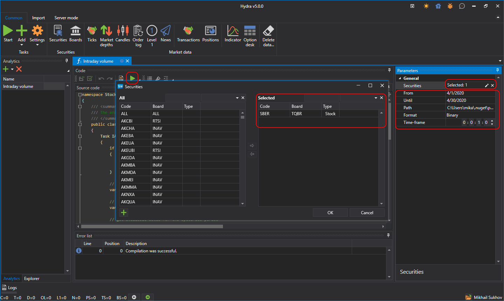

# Skript ausfuhren

Um ein neues Analytics-Skript zu erstellen, wahlen Sie im Panel der Datenquellen im Hauptfenster die Registerkarte **Analytics** und wahlen im Dropdown-Menu die gewunschte Vorlage fur einen schnellen Einstieg aus:

Der Screenshot zeigt die Hauptoberflache dieser Funktion, die aus mehreren wichtigen Komponenten besteht:

- **Navigationsbaum**: Bietet schnellen Zugriff auf verschiedene Analytics-Funktionen und erstellte Analyseskripte, zum Beispiel Intraday-Volumenanalyse, Volume Profile, Charts, Indikatoren und andere Analysewerkzeuge.
- **Codefenster**: Das Codefenster zeigt den Quellcode des ausgewahlten Analyseskripts. Benutzer konnen den Code direkt bearbeiten, um analytische Berechnungen und Strategien anzupassen oder zu erstellen.
- **Parameterpanel**: Auf der rechten Seite befindet sich ein Parameterpanel, in dem Sie Parameter fur Analyseskripte festlegen konnen, einschliesslich Auswahl von Instrumenten, Analysezeitraum, Datenpfad und weiteren Einstellungen.
- **Fehlerliste**: Am unteren Rand der Oberflache befindet sich eine Liste der Fehler, die wahrend der Kompilierung oder Ausfuhrung des Analyseskripts erkannt wurden.

Das Analyseskript ist als Klasse formatiert, die von [IAnalyticsScript](xref:StockSharp.Algo.Analytics.IAnalyticsScript) erbt.

Beim Festlegen der Parameter:

- **Instrument** kann je nach Logik des Skripts auf ein oder mehrere Instrumente gesetzt werden.

- Der Datumsbereich.
- Der Speicher, aus dem Daten abgerufen werden sollen.
- Der Arbeits-Timeframe des Skripts, falls es einen verwendet.

Durch Klicken auf die Schaltflache **Start**  wird eine neue Registerkarte mit den Ergebnissen der Skriptausfuhrung geoffnet.

