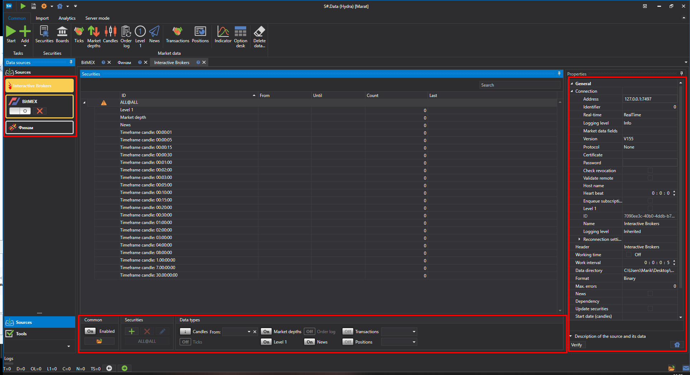
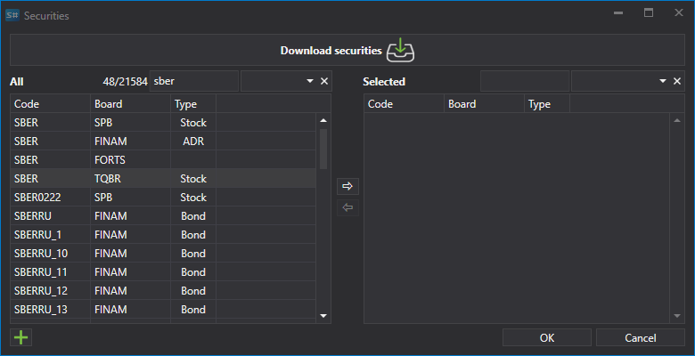
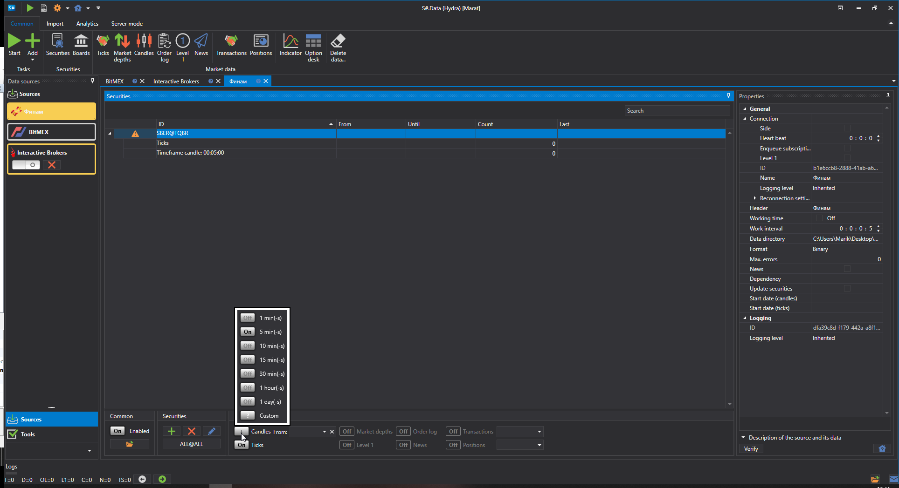
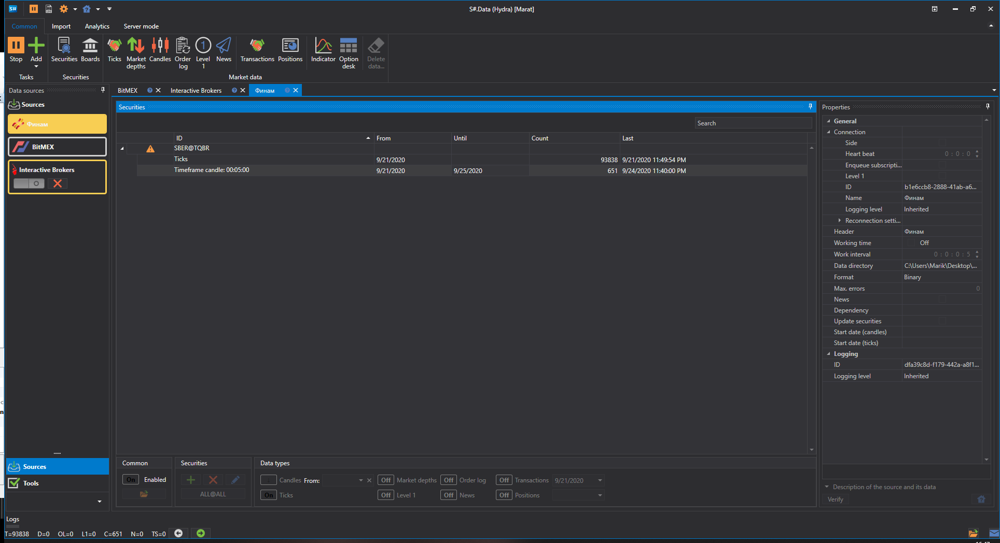

# Erster Start

Beim ersten Start erscheint das folgende Fenster zur Auswahl von Datenquellen. Sie können dieses Fenster auch auf der Registerkarte **Allgemein** öffnen, indem Sie **Hinzufügen \=\> Quellen** auswählen.

Markieren Sie im Fenster die erforderlichen Quellen. Sie können Filter nach Region, Board, Datentyp, Zahlungsart, Echtzeit oder nicht verwenden. Wenn die Auswahl abgeschlossen ist, klicken Sie auf **OK**. Danach bietet das Programm an, die Hilfsprogramme zu aktivieren. Weitere Details zur Arbeit mit Hilfsprogrammen finden Sie im Abschnitt [Utilities](tasks.md). Klicken Sie auf **OK**.

Danach werden die Quellen zum linken Panel des Hauptfensters der Anwendung hinzugefügt.

## Instrument zum Hochladen von Marktdaten herunterladen:

Bevor Sie mit dem Herunterladen von Marktdaten beginnen, müssen Sie die Instrumente einrichten, für die Marktdaten abgerufen werden sollen.

Nach dem Hinzufügen von Marktdatenquellen werden im zentralen Bereich Panels der hinzugefügten Quellen geöffnet, in denen eine Liste der Instrumente angezeigt wird. Wenn das Panel geschlossen ist, öffnen Sie es durch Doppelklick auf das Quellenlogo in der Liste links im Programm.

Laden Sie zum Beispiel das Instrument AAPL@NASDAQ aus einer unterstützten Datenquelle herunter.

> [!TIP]
> WICHTIG\! Daten werden nur für die Instrumente heruntergeladen, die der Instrumentenliste hinzugefügt wurden

1. Instrumente hinzufügen.

   Beim ersten Start bietet das Programm an, alle Instrumente für die ausgewählte Quelle auf einmal herunterzuladen. Danach lädt der Benutzer die Instrumente selbst herunter. Anfänglich ist die Instrumentendatenbank in [Hydra](../hydra.md) leer; es gibt nur das Hilfsinstrument **ALL@ALL**. Wenn dieses Instrument ausgewählt ist, werden Daten für alle für diese Quelle verfügbaren Instrumente heruntergeladen.

   Um ein Instrument hinzuzufügen, klicken Sie auf die Schaltfläche **Hinzufügen** . Danach öffnet sich ein Fenster zum Herunterladen des Instruments. 

   Um die Instrumente herunterzuladen, klicken Sie auf die entsprechende Schaltfläche **Instrumente herunterladen**.

   Danach erscheint auf dem Bildschirm ein Menü, in dem der Benutzer **Alle Instrumente herunterladen** auswählen kann.

   Oder Sie können für eine Reihe von Quellen die Instrumente [konfigurieren](prepare_for_download/instruments_list.md), die heruntergeladen werden sollen.

   Nachdem die Instrumente empfangen wurden, sieht das Fenster wie folgt aus.

   Es listet alle Instrumente auf, die zum Hinzufügen verfügbar sind. Für eine schnelle Suche können Sie den Namen in das entsprechende Feld eingeben.

   Um ein Instrument auszuwählen, doppelklicken Sie darauf, und es wird auf die rechte Seite der Liste verschoben.

   Anschliessend wird es auf die rechte Seite der Tabelle verschoben.

   Die ausgewählten Instrumente werden in der Tabelle **Instrumente** angezeigt, die baumartig strukturiert ist. Das Hauptelement ist das Instrument, die zusätzlichen Elemente sind die Marktdatentypen, die für dieses Instrument empfangen werden.
2. Für jedes ausgewählte Instrument sollten Sie die Marktdatentypen auswählen, die für den Download erforderlich sind.

   Wenn nicht alle erforderlichen Instrumentparameter gesetzt sind, erscheint in der linken Spalte der Instrumentzeile das Symbol . 

   Wählen wir für den Download **Ticks** und **Kerzen Zeitrahmen 5** aus.

   Am unteren Rand des Quellenfensters befindet sich ein Panel mit Schaltflächen zur Einrichtung der zu empfangenden Daten und Instrumente. 

   In diesem Panel können die folgenden Operationen ausgeführt werden:
   - Konfigurieren der Menge der empfangenen Informationen mit den Schaltflächen: **Geschäfte, Orderbücher, Kerzen, Orderprotokoll, Level 1, Eigene Transaktionen**. Die Listen verfügbarer Marktdatentypen unterscheiden sich je nach Quelle.
   - Den erforderlichen Zeitrahmen für die geladenen Kerzen angeben. Der Zeitrahmen der empfangenen Kerzen unterscheidet sich je nach Quelle.
   - Den erforderlichen Zeitraum für das Herunterladen von Marktdaten festlegen. Der Zeitraum kann auch direkt im Marktdatenfenster konfiguriert werden. Dazu wählen Sie den Beginn und das Ende des Zeitraums aus.

     Wenn der Benutzer kein Enddatum für den Zeitraum angibt, lädt das Programm alle für das aktuelle Datum verfügbaren Daten herunter. Wenn die Quelle die Übertragung von Marktdaten in Echtzeit unterstützt, werden die Marktdaten bei fehlendem Enddatum für den Zeitraum in Echtzeit heruntergeladen.

     Legen wir den Zeitraum fest, für den die Marktdaten heruntergeladen werden sollen.
   - Angeben, woraus die Marktdaten erstellt werden sollen. Wenn dieser Parameter nicht angegeben ist, werden die in der Quelle verfügbaren Kerzen empfangen. Wenn der Benutzer den Marktdatentyp angibt, werden Kerzen aus dem angegebenen Marktdatentyp erstellt. Zum Beispiel können Kerzen aus dem letzten Handelspreis, dem Order-Book-Spread (üblicherweise für den Forex-Markt), der Volatilität oder dem besten Preis erstellt werden.

     Diese Funktion ist praktisch, wenn die Quelle keine Daten für die Kerzendarstellung bereitstellt. In diesem Fall werden Kerzen auf Basis gemittelter Datenwerte gezeichnet.

     Der Benutzer hat außerdem die Möglichkeit, einen [benutzerdefinierten Typ](prepare_for_download/custom_candles.md) von Kerzen auszuwählen, um die empfangenen Daten anzupassen.
   - Nach Auswahl eines Instruments, eines Marktdatentyps und Festlegung des Zeitraums klicken Sie auf die Schaltfläche **Starten**. Danach beginnt der Download der Marktdaten.

   Der Arbeitsprozess kann auf der speziellen Registerkarte **Protokolle** beobachtet werden, die am unteren Rand des Programms fixiert ist. Zusätzlich werden Protokolle in Dateien im lokalen Ordner gespeichert.

Außerdem kann der Benutzer [zusätzliche Quellen](data_sources/select_source.md) hinzufügen.

Nachdem die Marktdaten heruntergeladen wurden, kann der Benutzer [Marktdaten anzeigen](working_with_data/view_and_export.md), [Kerzen zeichnen](working_with_data/candles_generation.md), speichern oder [in verschiedene Formate exportieren](working_with_data/export_data.md).

**Sehen Sie sich das [Video-Tutorial](videos/first_start.md) an**.

