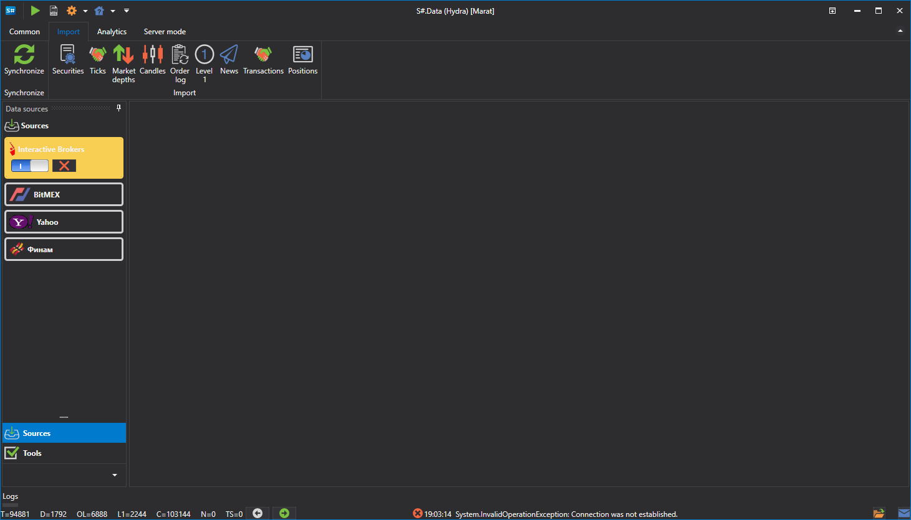

# Import

[Hydra](../hydra.md) ermoeglicht den Import eigener Daten, die im .csv-Format gespeichert sind. Oeffnen Sie fuer den Import die Registerkarte **Import** und waehlen Sie den Typ der Boersendaten aus, die Sie importieren moechten.

Die folgenden Typen koennen importiert werden:

- [Kerzen](importing/candles.md)
- [Instrumente](importing/instruments.md)
- [Trades](importing/ticks.md)
- [Order books](importing/order_books.md)
- [Order log](importing/order_log.md)
- [Level 1](importing/level_1.md)
- [Nachrichten](importing/news.md)
- [Eigene Transaktionen](importing/transactions.md)

**Sehen Sie sich das [Video-Tutorial](videos/import_task.md) an**
