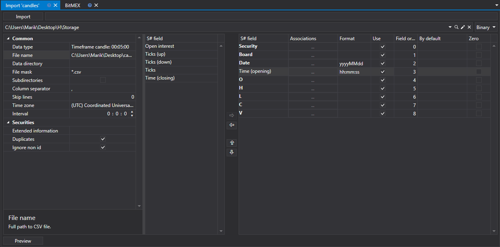

# Kerzen

Um Kerzen zu importieren, wählen Sie im Hauptmenü der Anwendung den Eintrag **Import \=\> Candles**.



## Kerzenimportprozess

1. **Common.**
   - **Data type** - Typ der importierten Daten.
   - **Filename** - Vollständiger Pfad zur CSV-Datei.
   - **Data directory** - Ordner, in dem die finalen [S#](../../api.md)-Dateien gespeichert werden.
   - **File mask** - Dateimaske, die beim Scannen des Verzeichnisses verwendet wird. Zum Beispiel candle \_\*.csv.
   - **Column separator** - Spaltentrennzeichen. Tabulator wird als TAB bezeichnet.
   - **Indent from the beginning** - Anzahl der Zeilen am Anfang der Datei, die ubersprungen werden sollen (wenn sie Metainformationen enthalten).
   - **Time zone** - Zeitzone.
   - **Interval** - Haufigkeit der Datenaktualisierung.

   **Instruments**
   - **Extended information** - Erweiterte importierte Felder im Speicher für erweiterte Informationen speichern
   - **Duplicates** - ob doppelte Instrumente aktualisiert werden, wenn sie bereits existieren.
2. Importparameter für [S#](../../api.md)-Felder konfigurieren.
   - **S# field** - Wert des S#-Feldes. ( **Security, Board** usw.).
   - **Associations** - Spaltenwert in der Datei dem StockSharp-Typ zuordnen (falls erforderlich).
   - **Format** - Datenformat. Wird typischerweise beim Import von Datums- und Zeitwerten verwendet (siehe [Trades](ticks.md)).
   - **Use** - ob die Daten beim Import verwendet werden sollen.
   - **Field order** - Reihenfolge, in der die Eigenschaftsspalten des importierten Elements angeordnet sind.

     Wenn die importierte Datei zum Beispiel die folgende Vorlage hat:

     ```none
     {SecurityId.SecurityCode},{SecurityId.BoardCode},{OpenTime:yyyyMMdd},{OpenTime:default:HH:mm:ss},{OpenPrice},{HighPrice},{LowPrice},{ClosePrice},{TotalVolume}

     ```

     Dann entspricht die folgende Einstellung dieser Vorlage:

     Hier:

     Der Wert **Security** entspricht **{SecurityId.SecurityCode}** mit der fortlaufenden Nummer **0**.

     > [!TIP]
     > In der Programmierung ist die Ordnungsnummer des ersten Elements immer 0

     Der Wert **Board** entspricht **{SecurityId.BoardCode}** mit der fortlaufenden Nummer **1**. Und so weiter.
   - **By default** - Standardwert des Feldes. Er kann zum Beispiel für wiederholte Feldwerte verwendet werden (Security **oder Board** beim Import von Trades, Order Books usw., siehe [Trades](ticks.md)), wenn die entsprechende Information in der Datendatei fehlt.
   - **Zero** - In einigen Fällen können beim Speichern von Daten einzelne Dateneigenschaften als "0" gespeichert werden, was ein Fehler ist. Beispielsweise kann der Preiswert aus verschiedenen Gründen 0 sein, was unzulässig ist und später zu einem fehlerhaften Lesen führt. Dies kann zu fehlerhafter Strategieausfuhrung bei Strategien führen, die mit diesen Daten arbeiten, und folglich zu einem falschen Ergebnis. Durch Aktivieren des Kontrollkästchens gibt der Benutzer an, dass Daten in diesem Abschnitt, wenn sie 0 entsprechen, als leer geschrieben werden, also fehlen. Bei der weiteren Arbeit, zum Beispiel beim Testen, sieht der Benutzer einen Fehler wegen fehlender Daten, der auf einen fehlerhaften Datenimport hinweist. Tatsächlich ist dies ein Schutz des Benutzers vor "defekten" Daten für eine korrektere Arbeit.

   Der Benutzer kann eine große Anzahl von Eigenschaften für die heruntergeladenen Daten konfigurieren. Auf Basis der Vorlage der importierten Datei müssen Sie die Eigenschaft angeben und ihr die erforderliche Nummer in der Reihenfolge zuweisen.
3. Um eine Vorschau der Daten anzuzeigen, klicken Sie auf die Schaltfläche **Preview**.
4. Klicken Sie auf die Schaltfläche **Import**.

