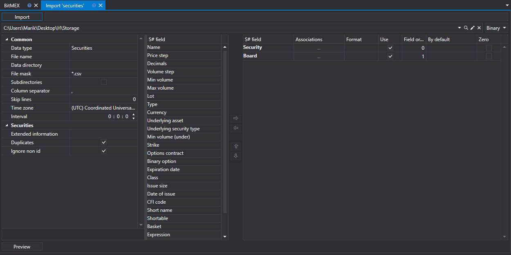

# Instrumente

Um Instrumente zu importieren, wählen Sie die Registerkarte **Import \=\> Instruments**.



## Importprozess.

1. **Import settings.**.

   Siehe Import von [Kerzen](candles.md).
2. Importparameter für [S#](../../api.md)-Felder konfigurieren.

   Siehe Import von [Kerzen](candles.md).

   **Betrachten wir ein Beispiel für den Import eines Instruments aus einer CSV-Datei:**
   - Die Datei, aus der Sie Daten importieren möchten, hat die folgende Vorlage:

     ```none
     {SecurityId.SecurityCode};{SecurityId.BoardCode};{PriceStep};{SecurityType};{VolumeStep}

     ```

     Hier entsprechen die Werte von {SecurityId.SecurityCode} und {SecurityId.BoardCode} den Werten **Security** bzw. **Board**. Daher weisen wir im Feld **Field order** die Werte 0 bzw. 1 zu.
   - Für das Feld {PriceStep} wählen Sie im Fenster **S# field** das Feld **Nominal** und weisen ihm den Wert 2 zu.
   - Für das Feld {SecurityType} wählen Sie im Fenster **S# field** das Feld **Type** - den Instrumenttyp (Aktie, Wahrung, Futures usw.). Wir weisen ihm den Wert 3 zu.
   - Für das Feld {VolumeStep} wählen Sie im Fenster **S# field** das Feld **Min volume (base)** - das Basis- oder Mindestvolumen des Instruments. Wir weisen ihm den Wert 4 zu.
   - Das Fenster zur Feldeinstellung sieht wie folgt aus:

   Der Benutzer kann eine große Anzahl von Eigenschaften für die heruntergeladenen Daten konfigurieren. Auf Basis der Vorlage der importierten Datei müssen Sie die Eigenschaft angeben und ihr die erforderliche Nummer in der Reihenfolge zuweisen.
3. Um eine Vorschau der Daten anzuzeigen, klicken Sie auf die Schaltfläche **Preview**.
4. Klicken Sie auf die Schaltfläche **Import**.

