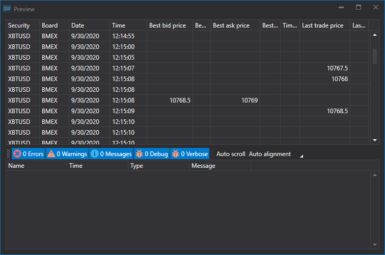

# Level 1

Um Level-1-Daten zu importieren, wählen Sie im Hauptmenü der Anwendung **Import \=\> Level 1**


## Importprozess.

1. **Import settings.**.

   Siehe Import von [Kerzen](candles.md).
2. Importparameter für [S#](../../api.md)-Felder konfigurieren.

   Siehe Import von [Kerzen](candles.md).

   **Betrachten wir ein Beispiel für den Import von Level 1 aus einer CSV-Datei:**
   - Die Datei, aus der Sie Daten importieren möchten, hat die folgende Vorlage:

     ```none
     {SecurityId.SecurityCode};{SecurityId.BoardCode};{ServerTime:default:yyyyMMdd};{ServerTime:default:HH:mm:ss.ffffff};{Changes:{BestBidPrice};{BestBidVolume};{BestAskPrice};{BestAskVolume};{LastTradeTime};{LastTradePrice};{LastTradeVolume}}

     ```

     Hier entsprechen die Werte von {SecurityId.SecurityCode} und {SecurityId.BoardCode} den Werten **Security** bzw. **Board**. Daher weisen wir im Feld **Field order** die Werte 0 bzw. 1 zu.
   - Für die Felder {ServerTime:default:yyyyMMdd} und {ServerTime:default:HH:mm:ss.ffffff} wählen Sie im Fenster **S# field** die Felder Date bzw. **Time**. Wir weisen die Werte 2 und 3 zu.
   - Für das Feld {BestBidPrice} wählen Sie im Fenster **S# field** das Feld **Best buy price**. Wir weisen ihm den Wert 4 zu.
   - Für das Feld {BestBidVolume} wählen Sie im Fenster **S# field** das Feld **Best buy volume**. Wir weisen ihm den Wert 5 zu.
   - Für das Feld {BestAskPrice} wählen Sie im Fenster **S# field** das Feld **Best sale price**. Wir weisen ihm den Wert 6 zu.
   - Für das Feld {BestAskVolume} wählen Sie im Fenster **S# field** das Feld **Best sale volume**. Wir weisen ihm den Wert 7 zu.
   - Für das Feld {LastTradeTime} wählen Sie im Fenster **S# field** das Feld **Last trade time**. Wir weisen ihm den Wert 8 zu.
   - Für das Feld {LastTradePrice} wählen Sie im Fenster **S# field** das Feld **Last trade price**. Wir weisen ihm den Wert 9 zu.
   - Für das Feld {LastTradeVolume} wählen Sie im Fenster **S# field** das Feld **Last trade volume**. Wir weisen ihm den Wert 10 zu.
   - Das Fenster zur Feldeinstellung sieht wie folgt aus:

   Der Benutzer kann eine große Anzahl von Eigenschaften für die heruntergeladenen Daten konfigurieren. Auf Basis der Vorlage der importierten Datei müssen Sie die Eigenschaft angeben und ihr die erforderliche Nummer in der Reihenfolge zuweisen.
3. Um eine Vorschau der Daten anzuzeigen, klicken Sie auf die Schaltfläche **Vorschau**.
4. Klicken Sie auf die Schaltfläche **Importieren**.
