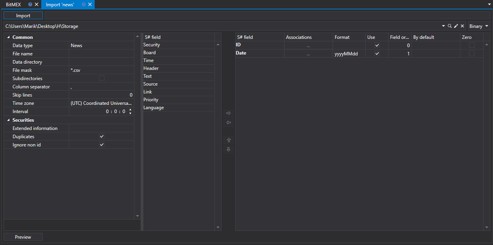

# Nachrichten

Um Nachrichten zu importieren, wählen Sie im Hauptmenü der Anwendung **Importieren \=\> Nachrichten**.

## Nachrichtenimportprozess

1. Führen Sie **CSV-Importeinstellungen** aus.

   Siehe Import von [Kerzen](candles.md).
2. Importparameter für [S#](../../api.md)-Felder konfigurieren.

   Siehe Import von [Kerzen](candles.md).
3. Um eine Vorschau der Daten anzuzeigen, klicken Sie auf die Schaltfläche **Vorschau**
4. Klicken Sie auf die Schaltfläche **Importieren**.
