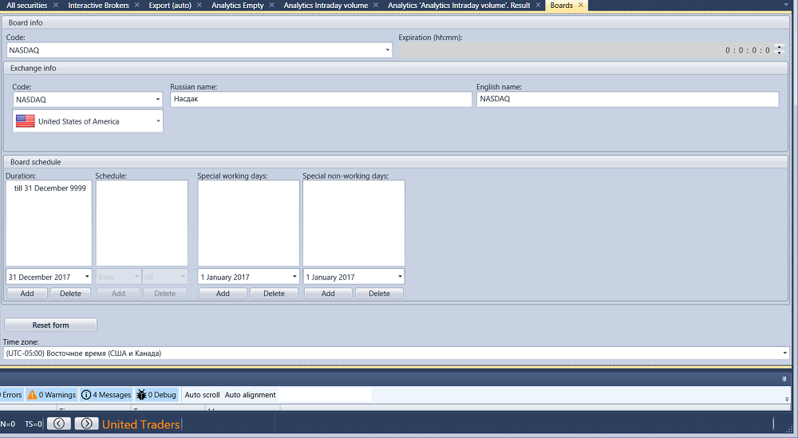

# Handelsplätze

Klicken Sie auf der Registerkarte **Common** auf die Schaltfläche **Boards**.

Hier können Sie grundlegende Informationen zu Trading Boards anzeigen sowie deren Zeitzone und Arbeitszeitplan festlegen.

