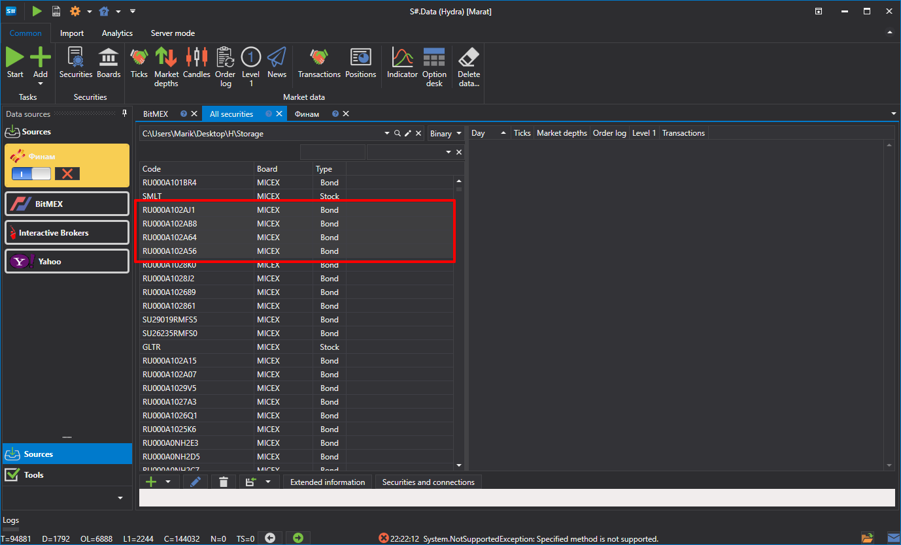
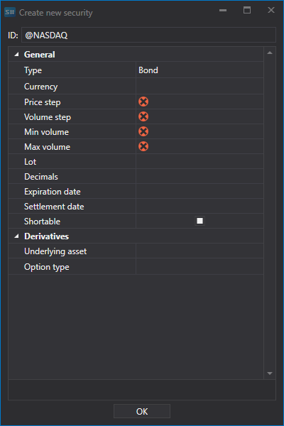

# Instrumente bearbeiten

Um ein Instrument zu bearbeiten, zum Beispiel wenn es ohne alle erforderlichen Daten erstellt wurde, doppelklicken Sie auf das Instrument oder klicken Sie auf die Schaltfläche , um das Fenster zu öffnen, in dem Sie die notwendigen Aenderungen vornehmen können:

Wechseln Sie zum Fenster **Securities**.

Das Bearbeitungsfenster wird geöffnet.

Bei Bedarf können Sie die Instrumentengruppe bearbeiten. Wählen Sie eine Instrumentengruppe aus und klicken Sie auf die Schaltfläche .

Bearbeiten Sie danach die Gruppe nach Bedarf.

Wenn alle ausgewählten Instrumente in einem Feld denselben Wert haben, wird dieser Wert angezeigt. Wenn sich die Werte unterscheiden, bleibt das Feld leer. Wenn zum Beispiel zwei Instrumente einen Price Step von 1 haben, aber eines eine Lot-Groesse von 10 und das andere von 100, zeigt das Feld Price Step den Wert 1 an, während das Feld Volume Step leer bleibt.
