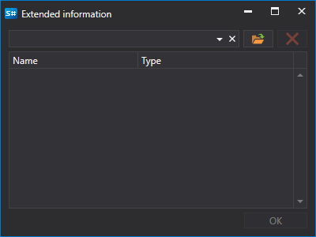
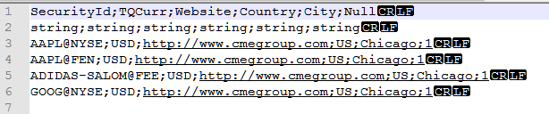

# Erweiterte Instrumentinformationen

Quellen für erweiterte Informationen sind **CSV**-Dateien im Ordner `c:\\Users\\Users\\Documents\\StockSharp\\Hydra\\Extended info\\`. Sie werden beim Start von [Hydra](../../hydra.md) automatisch geladen.

Erweiterte Informationen können beliebige zusätzliche Angaben zu einem Instrument enthalten, zum Beispiel Land, Stadt, Board usw.

Jede Quelle erweiterter Informationen (CSV-Datei) enthält eine Liste von Instrumenten und die verfügbaren Eigenschaften. Für jede Quelle sind die erweiterten Informationen eindeutig.

Wenn die Quelle keine erweiterten Informationen für ein Instrument enthält, bleiben die entsprechenden Spalten in der Instrumentenliste leer.

Um die erforderlichen erweiterten Informationen auszuwählen, gehen Sie wie folgt vor:

1. Klicken Sie auf der Registerkarte **Instrumente** auf die Schaltfläche **Erweiterte Informationen**.
2. Es erscheint ein Fenster, in dem Sie den Pfad zur erforderlichen CSV-Datei auswählen müssen.

Unten sehen Sie ein Beispiel einer **CSV**-Datei mit erweiterten Informationen, geöffnet in verschiedenen Editoren: **MS Excel** und **Notepad**.

