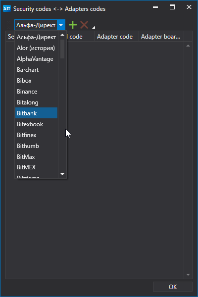
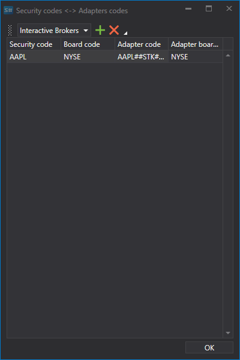
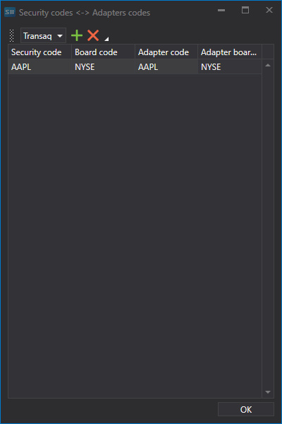
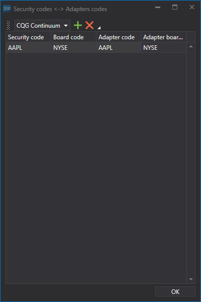

# Instrumente-Verbindungen zuordnen

Dasselbe Instrument kann in verschiedenen Handelssystemen unterschiedlich bezeichnet werden. Sie koennen das Instrument und die Verbindungen zuordnen, ueber die dieses Instrument gehandelt wird, und festlegen, wie es im externen Handelssystem identifiziert wird.

Dadurch koennen Sie die empfangenen Daten organisieren und die Speicherung vereinfachen. Tatsaechlich werden alle eingehenden Daten aus verschiedenen Quellen an einem Ort konsolidiert, und zwar nicht nach dem Quellnamen, sondern nach dem Instrumentennamen.

Dies ist auch nuetzlich, wenn dasselbe Instrument auf verschiedenen Trading Boards oder ueber unterschiedliche Verbindungen (oder Broker) gehandelt wird. Ausserdem koennen Daten ueber eine Verbindung empfangen und Trades ueber eine andere Verbindung ausgefuehrt werden.

Um Instrumente und Verbindungen zuzuordnen, gehen Sie wie folgt vor:

1. Wechseln Sie zur Registerkarte **Securities** und klicken Sie auf die Schaltflaeche **Securities and Connections**.
2. Waehlen Sie in der Verbindungsliste die erforderliche Verbindung aus.
3. Fuellen Sie alle Spalten aus.

   Beispiel:

   APPLE-Aktieninstrument.
   - Connection - **Interactive Brokers**. Klicken Sie auf die Schaltflaeche , danach wird eine neue Zeile hinzugefuegt.
   - Geben Sie in den Spalten **Security** code und **Board code** den Instrumentcode und den Board-Code an. Geben Sie in den Spalten **Security code in adapter** und **Board code in adapter** den Instrumentcode und den Board-Code so an, wie sie im externen Handelssystem angegeben sind. Klicken Sie auf **OK** 
   - Wiederholen Sie die Schritte fuer die Verbindungen **Interactive Brokers** und **CQG Continuum** auf die gleiche Weise.

   | **Interactive Brokers**                                                           | **CQG Continuum**                                                                 |
   | --------------------------------------------------------------------------------- | --------------------------------------------------------------------------------- |
   |  |  |
4. Nun werden alle heruntergeladenen Daten, in unserem Fall fuer APPLE-Aktien, an einem Ort gespeichert.
