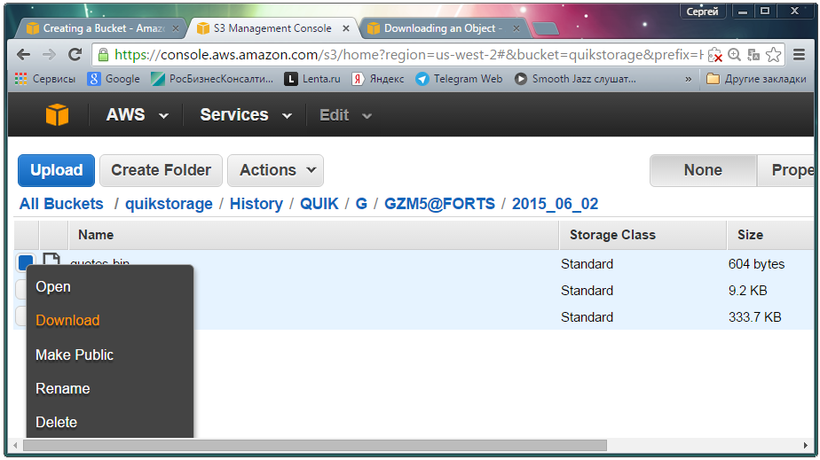

# Wiederherstellung

Sie können die Daten auf zwei Arten aus dem Speicher wiederherstellen:

- Gespeicherte Objekte aus der AWS-Konsole herunterladen. Klicken Sie dazu mit der rechten Maustaste auf das Objekt und wählen Sie im Kontextmenü **Download**.

  > [!TIP]
  > Mit dieser Methode können Sie jeweils nur ein Objekt (eine Datei) herunterladen.
- Die kostenlose Anwendung [S3 Browser](https://s3browser.com/) zum Herunterladen von Daten verwenden.
