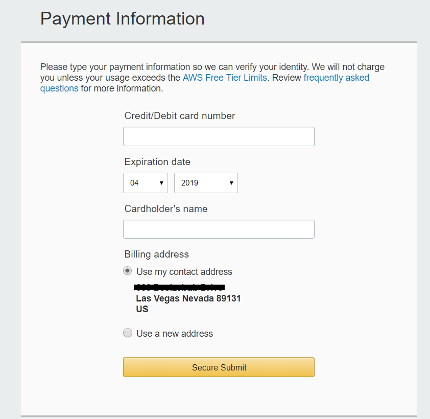
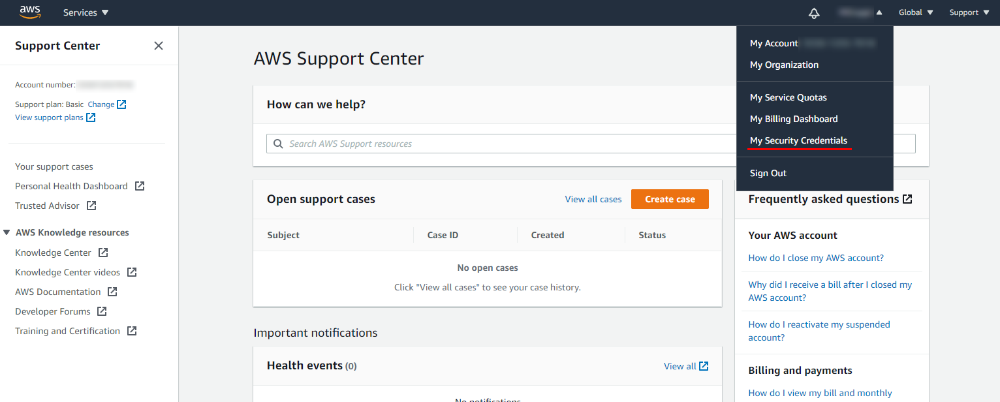

# Einrichtung

Im Folgenden wird beschrieben, wie Sie ein AWS-Konto erstellen und konfigurieren.

1. Um ein AWS-Konto zu erstellen, gehen Sie zur Seite [AWS-Konto erstellen](https://aws.amazon.com/ru/) und klicken auf die Schaltfläche **Konto erstellen**.
2. Füllen Sie anschließend die Formulare aus, die der Webservice anbietet.
3. Geben Sie Ihre Kartendaten ein. Dies dient der Überprüfung Ihrer Identität.
4. In einem der Registrierungsschritte werden Sie aufgefordert, eine Telefonnummer einzugeben und über die Schaltfläche **Call Me Now** einen Anruf auf Ihr Telefon zu starten.

   Nehmen Sie den Anruf an und geben Sie auf dem Telefon den Code ein, der auf dem Computerbildschirm angezeigt wird.
5. Danach werden Sie aufgefordert, einen Supportplan auszuwählen. Nach Abschluss der Kontoerstellung müssen Sie zur Verwaltungskonsole wechseln.
6. Der erste Schritt bei der Kontoeinrichtung besteht darin, einen Bucket zu erstellen.

   Ein Bucket ist ein Container zum Speichern von Objekten in der Cloud. Für einen Bucket müssen Sie einen eindeutigen Namen festlegen und außerdem ein regionales Rechenzentrum (Region) auswählen, in dem die Daten physisch gespeichert werden. Beachten Sie bei der späteren Konfiguration der Backup-Aufgabe: 1) Im Feld **Speicher** müssen Sie den Bucket-Namen eingeben, 2) im Feld **Adresse** müssen Sie nicht den Namen, sondern die Adresse des regionalen Rechenzentrums verwenden, die Sie [hier](https://docs.aws.amazon.com/general/latest/gr/rande.html#s3_region) finden. Fahren Sie danach mit der Konfiguration fort.
7. Anschließend müssen Sie Schlüssel für den programmgesteuerten Zugriff auf AWS-Services festlegen. Wechseln Sie dazu in der AWS-Konsole zum Link **Security Credentials**.
8. Erweitern Sie die Überschrift **Access Keys (Access Key ID and Secret Access Key)** und erstellen Sie Zugriffsschlüssel über die Schaltfläche .

  Die erstellten Schlüssel können über die Schaltfläche **Download Key File** in einer Datei gespeichert werden.

   Beachten Sie, dass bei der Konfiguration einer Backup-Aufgabe die **Access Key ID** als Login und der **Secret Access Key** als Passwort verwendet werden muss.

## Empfohlene Inhalte

[Aufgabe erstellen und konfigurieren](hydra_settings.md)
