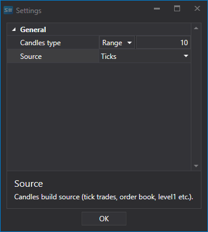
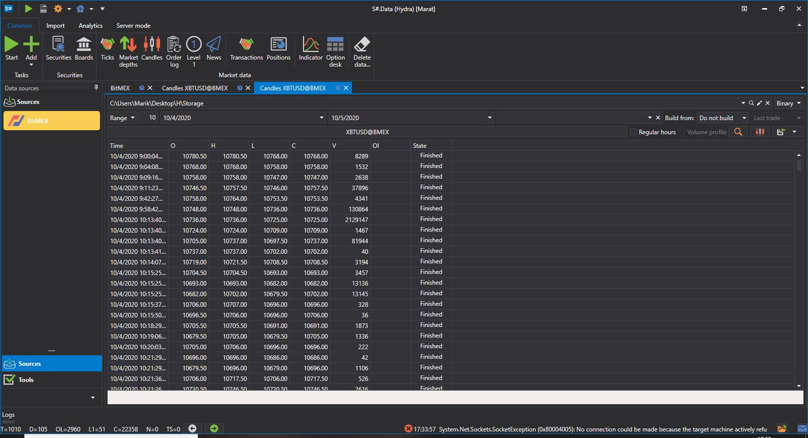

# Benutzerdefinierte Kerzen

Der Benutzer kann einen **benutzerdefinierten Typ** von Kerzen auswählen und selbst festlegen, welche Kerzen erstellt werden. Dabei werden die Kerzen direkt, also unmittelbar, erstellt.

Betrachten wir ein Beispiel für eine solche Erstellung. Die Börse **Bitmex** bietet keine Möglichkeit, Kerzen mit einem Zeitrahmen von 10 Minuten zu empfangen.

Die Reihenfolge zum Erhalten solcher Kerzen:

1. Wählen Sie **benutzerdefinierte** Kerzen.
2. In den Einstellungen geben wir **TF** candles und einen Zeitraum von 10 Minuten an.
3. In der Quelle geben wir an, woraus die Kerzen erstellt werden sollen - **Orderprotokoll**. 
4. Wir legen den Zeitraum fest. Wie Sie sehen, ist neben dem Kerzennamen der Hinweis **Generiert** erschienen.
5. Klicken Sie auf Start, und der Datendownload beginnt.
6. Wechseln Sie zum Kerzenabschnitt und [sehen Sie sich die heruntergeladenen Daten an](../working_with_data/view_and_export.md).

Wie Sie sehen, wurden die Daten erfolgreich empfangen.

Betrachten wir ein Beispiel, in dem wir eine [RangeCandleMessage](xref:StockSharp.Messages.RangeCandleMessage) erhalten müssen:

1. Wählen Sie **benutzerdefinierte** Kerzen.
2. Geben Sie in den Einstellungen Range-Kerzen und das Volumen 10 an.
3. In der Quelle geben wir an, woraus die Kerzen erstellt werden sollen - **Ticks**.
4. Wir legen den Zeitraum fest.
5. Klicken Sie auf Start, und der Datendownload beginnt.
6. Wechseln Sie zum Kerzenabschnitt und [sehen Sie sich die heruntergeladenen Daten an](../working_with_data/view_and_export.md).
