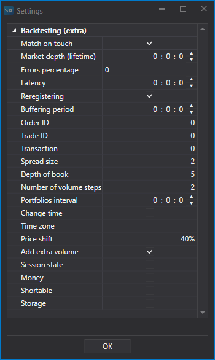

# Emulation einrichten

Im Servermodus ermöglicht das Programm, den Emulationsmodus zu aktivieren.

Im Emulationsmodus bietet das Programm [Hydra](../../hydra.md) die folgenden Funktionen:

- Das Programm ermöglicht die Konfiguration der Schluessel für die Verbindung zur Quelle und gleichzeitig die Arbeit mit einer Verbindung in verschiedenen Programmen ([Designer](../../designer.md), [Terminal](../../terminal.md)).
- Wenn die Marktdatenquelle das Herunterladen historischer Daten ermöglicht, können diese gleichzeitig zum Testen verwendet werden.
- Wenn die Quelle Daten in Echtzeit empfangen kann, ermöglicht der Emulationsmodus die Nachbildung des Handelsmodus. In diesem Modus werden Daten über Benutzeraktionen (Orderregistrierung, Trades) direkt an Hydra uebertragen, während Aktionen für jedes Programm separat aufgezeichnet werden. Wenn zum Beispiel in Terminal eine Order registriert wird, sind Aenderungen daran nur dort sichtbar und werden in Designer nicht erfasst. Dadurch werden Konflikte zwischen zwei Programmen vermieden, die über dieselbe Verbindung laufen.
- WICHTIG\! Trades, die im Emulationsmodus ausgeführt werden, sowie Handel und Operationen daran werden in Echtzeit emuliert. Wenn der Modus ausgeschaltet ist, werden Aktionen im realen Handel ausgeführt.

Dieser Modus wird beim [Testen von Strategien](../../shell/user_interface/emulation.md) verwendet.

## Emulationseinstellungen.

- **Match on touch** - beim Emulieren der Trade-Zuordnung Orders zuordnen, wenn der Trade-Preis dem Orderpreis entspricht.
- **Order book (time in force)** - maximale Gueltigkeitsdauer des Order Books im Emulator. Wenn das Order Book innerhalb des angegebenen Zeitraums nicht aktualisiert wurde, wird sein Wert gelöscht. Dies wird verwendet, um alte Order-Book-Daten zu entfernen, wenn Datenluecken vorhanden sind.
- **Percentage of errors** - Prozentsatz von Fehlern beim Registrieren neuer Orders (von 0 bis 100).
- **Latency** - die minimale Latenz registrierter Orders.
- **Re-registration** - ob die Re-Registrierung von Orders als einzelne Transaktion unterstuetzt wird.
- **Buffering period** - Parameter, der für den Zeitraum verantwortlich ist, in dem ganze Pakete gesendet werden, um Netzwerklatenz zu emulieren und die Arbeit des Boersenkerns zu puffern.
- **Order ID** - die Nummer, mit der der Emulator Kennungen für Orders generiert.
- **Trade identifier** - die Nummer, mit der der Emulator Kennungen für Trades generiert.
- **Transaction** - die Nummer, mit der der Emulator Kennungen für Ordertransaktionen generiert.
- **Spread size** - Spread-Groesse in Preisschritten. Wird verwendet, um den Spread beim Erzeugen des Order Books aus Tick-Trades zu bestimmen.
- **Order book depth** - maximale Order-Book-Tiefe, die aus Ticks erzeugt wird.
- **Number of volume steps** - die Anzahl der Volumenschritte, um die die Order groesser ist als der Tick-Trade. Wird beim Testen auf Tick-Trades verwendet.
- **Portfolio interval** - Intervall für die Neuberechnung von Portfoliodaten. Wenn das Intervall 0 ist, erfolgt keine Neuberechnung.
- **Adjust time** - Zeit für Orders und Trades an die Boersenzeit anpassen.
- **Time zone** - Informationen zur Zeitzone, in der sich die Boerse befindet.
- **Price shift** - Preisverschiebung vom letzten Trade, die die Grenzen der maximalen und minimalen Preise für die naechste Sitzung bestimmt.
- **Add additional volume** - zusätzliches Volumen zum Order Book hinzufügen, wenn Orders mit grossem Volumen registriert werden.
- **Trading session state** - Pruefung des Handelsstatus.
- **Money** - Geldsaldo pruefen.
- **Short** - Moeglichkeit, Short-Positionen zu eroeffnen.
- **Storage** - Speicher.
