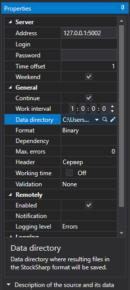

# Hydra Client verbinden

Im Servermodus kann ein weiteres Hydra-Programm verbunden werden, das als Client arbeitet und Daten zu sich selbst herunterlädt. Im Unterschied zu [Verbindung über FIX protocol](fix_fast_connectivity.md) werden Daten in Form von Dateien im StockSharp-Format übertragen. Dadurch eignet sich die Quelle für die Übertragung größer Mengen historischer Daten.

Für die Verbindung wird eine spezielle Quelle verwendet:

**Einstellungen**

- **Adresse** - die Adresse des Hydra-Servers.
- **Anmeldung** - Login (erforderlich, wenn der Server Autorisierung verlangt).
- **Passwort** - Passwort (erforderlich, wenn der Server Autorisierung verlangt).
- **Zeitversatz** - ein Zeitoffset in Tagen ab dem aktuellen Datum, erforderlich, um das Herunterladen unvollständiger Daten für die aktuelle Handelssitzung zu verhindern.
- **Wochenenden** - ob Daten für Wochenenden heruntergeladen werden sollen.

**Hauptbereich**

- **Titel** - der Titel der Aufgabe.
- **Arbeitszeiten** - Einstellung des Plattformbetriebs.
- **Betriebsintervall** - Ausführungsintervall.
- **Datenverzeichnis** - das Datenverzeichnis, in dem die finalen Dateien im [S#](../../api.md)-Format gespeichert werden.
- **Format** - Datenformat: BIN/CSV.
- **Max. Fehler** - die maximale Anzahl von Fehlern, bei deren Erreichen die Aufgabe gestoppt wird. Standardmäßig 0, die Anzahl der Fehler wird ignoriert.
- **Abhängigkeit** - eine Aufgabe, die vor dem Start der aktuellen Aufgabe abgeschlossen sein muss.

**Protokollierung**

- **Kennung** - Kennung.
- **Protokollierungsstufe** - Logging-Level.
