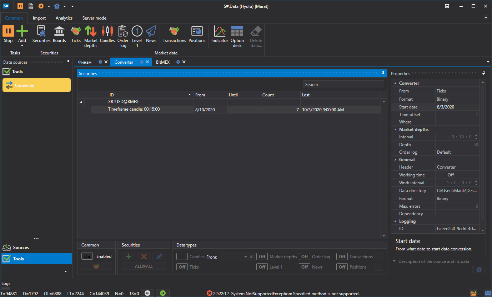

# Konverter

Die Aufgabe konvertiert Börsendaten. Zum Beispiel von Order Logs in Ticks oder von Ticks in Kerzen usw.

**Converter**

- **Converter** - Converter.
- **From** - welcher Datentyp konvertiert wird.
- **Data format** - Format der konvertierten Daten.
- **Start date** - ab welchem Datum die Datenkonvertierung gestartet werden soll.
- **Time offset** - Zeitoffset in Tagen ab dem Datum, an dem die Aufgabe gestartet wurde. Dies verhindert die Konvertierung eines unvollstaendigen Tages. Wenn die Datenkonvertierung in Echtzeit konfiguriert ist, kann das Aktualisierungsintervall den aktuellen Tag nur teilweise konvertieren. Verwenden Sie den Zeitoffset, um dies zu vermeiden.
- **Where** - das Datenverzeichnis, in dem die konvertierten Daten gespeichert werden.

**Order books**

- **Interval** - Intervall für die Order-Book-Erzeugung.
- **Depth** - maximale Tiefe der Order-Book-Erzeugung.
- **Order log** - wie Order Books aus dem Order Log erstellt werden.

  Jede Börse hat ihr eigenes **Order Log**-Format. Das Programm [Hydra](../../hydra.md) unterstützt drei Formate:
  - **By default** - wird in den meisten Faellen verwendet.
  - **ITCH** - wird für das ITCH-Protokoll verwendet (Börsen: LSE und Nasdaq).

**General**

- **Header** - Converter.
- **Working hours** - Einrichtung des Arbeitszeitplans des Boards. 
- **Interval of operation** - das Ausführungsintervall.
- **Data directory** - Datenverzeichnis, aus dem die Daten für die Konvertierung gelesen werden.
- **Format** - Format der konvertierten Daten: BIN\/CSV.
- **Max. errors** - maximale Anzahl von Fehlern, bei deren Erreichen die Aufgabe gestoppt wird. Standardmäßig 0, die Anzahl der Fehler wird ignoriert.
- **Dependency** - eine Aufgabe, die vor dem Start der aktuellen Aufgabe ausgeführt werden muss.

**Logging**

- **Identifier** - die Kennung.
- **Logging level** - der Logging-Level.

Betrachten wir ein Beispiel für eine Datenkonvertierung.

1. Wechseln Sie zur Aufgabe **Converter**. 
2. Wählen Sie das Instrument aus und legen Sie im erscheinenden Fenster den Datentyp fest, der bei der Konvertierung entstehen soll, sowie den Datentyp, aus dem konvertiert werden soll. Zum Beispiel müssen Ticks in Kerzen mit einem Time Frame von 15 Minuten konvertiert werden.

   > [!TIP]
> WICHTIG\! Der angeforderte Datenzeitraum muss dem für die Konvertierung verfügbaren Zeitraum entsprechen, andernfalls werden die Daten nicht konvertiert. Geben Sie in den Einstellungen das korrekte Quelldatenformat an, damit es dem Format der zu konvertierenden Daten entspricht.
3. Geben Sie die erforderlichen Verzeichnisse, den Zeitoffset und das Ausführungsintervall an.
4. Starten Sie die Konvertierung.

Es ist zu sehen, dass die Daten konvertiert wurden. [Sehen wir uns](../working_with_data/view_and_export.md) die resultierenden Daten an.

Diese Funktion ist vergleichbar mit dem [Abrufen der erforderlichen Marktdaten](../working_with_data/any_market_data_types.md) aus einem anderen Datentyp.

**Sehen Sie sich das [Video-Tutorial](../videos/converter_task.md) an**
