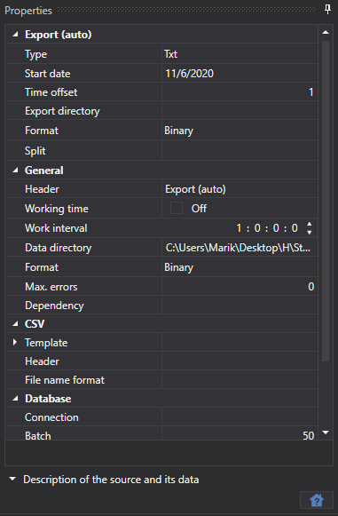
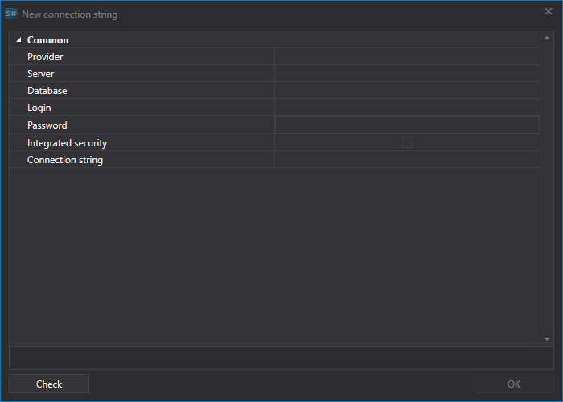

# Automatischer Export

Die Aufgabe exportiert Börsendaten in verschiedene Formate: Excel, xml, sql, bin, Json oder txt.

**Datenbank**

- **Verbindung** - Verbindung zur Datenbank. Wird beim Export über SQL verwendet.
- **Paket** - Größe des übertragenen Datenpakets. Standardmäßig beträgt die Größe 50 Elemente. Wird beim Export über SQL verwendet.
- **Eindeutigkeit** - Prüfung der Dateneindeutigkeit in der Datenbank. Beeinflusst die Performance. Standardmäßig aktiviert. Wird beim Export über SQL verwendet.

> [!TIP]
> Beim Export über SQL müssen die Parameter der Verbindungszeichenfolge gesetzt werden.

**Neue Verbindungszeichenfolge**

- **Provider** - Provider-Einstellungen.
- **Server** - Serveradresse oder Pfad zur Datenbank.
- **Datenbank** - Datenbankname. Wird für SQLite nicht verwendet.
- **Anmeldung** - Anmeldung für den Zugriff auf die Datenbank. Wird für anonymen Zugriff nicht verwendet.
- **Passwort** - Passwort für den Zugriff auf die Datenbank. Wird für anonymen Zugriff nicht verwendet.
- **Windows** - das aktuelle Windows-Konto für die Verbindung zur Datenbank verwenden.
- **Verbindung** - fertige Verbindungszeichenfolge.

> [!TIP]
> Sie können die Verbindung zur Datenbank mit der Schaltfläche **Prüfen** prüfen.

**Allgemein**

- **Kopfzeile** - Aufgabentitel.
- **Arbeitszeiten** - Einrichtung des Arbeitszeitplans des Boards. 
- **Betriebsintervall** - das Ausführungsintervall.
- **Datenverzeichnis** - Datenverzeichnis, aus dem die Daten für die Konvertierung gelesen werden.
- **Format** - Format der konvertierten Daten: BIN\/CSV.
- **Max. Fehler** - maximale Anzahl von Fehlern, bei deren Erreichen die Aufgabe gestoppt wird. Standardmäßig 0, die Anzahl der Fehler wird ignoriert.
- **Abhängigkeit** - eine Aufgabe, die vor dem Start der aktuellen Aufgabe ausgeführt werden muss.

**CSV**

- **Vorlagen** - Vorlagen für jeden Typ exportierter Daten.
- **Kopfzeile** - Kopfzeile in der ersten Zeile. Wenn eine leere Zeichenfolge übergeben wird, wird dem Dateianfang keine Kopfzeile hinzugefügt.
- **Namensformat** - Format für das Schreiben des exportierten Dateinamens.

**Export (automatisch)**

- **Typ** - Exporttyp (Format).
- **Startdatum** - ab welchem Datum der Datenexport gestartet werden soll.
- **Zeitversatz** - Zeitoffset in Tagen.
- **Exportverzeichnis** - Verzeichnis, in das Daten exportiert werden.
- **Format** - Datenformat.
- **Aufteilung** - Aufteilungstyp.

**Protokollierung**

- **Kennung** - die Kennung.
- **Protokollierungsstufe** - die Protokollierungsstufe.

Betrachten wir ein Beispiel für den automatischen Export:

1. Wählen Sie ein Instrument aus.
2. Richten Sie die Marktdaten ein, die exportiert werden müssen.
3. Legen Sie den Exportzeitraum fest. Wenn der Download von Marktdaten in Echtzeit konfiguriert ist, können Sie das Enddatum des Zeitraums weglassen. In diesem Fall werden die Daten gemäß dem Arbeitsintervall (Datenaktualisierung) in Echtzeit exportiert. 
4. Richten Sie Verzeichnisse, Ausführungsintervall, Datentyp und Datenformat ein.
5. Starten Sie den Export.

Sehen wir uns die exportierten Daten an.

**Sehen Sie sich das [Video-Tutorial](../videos/export_task.md) an**
