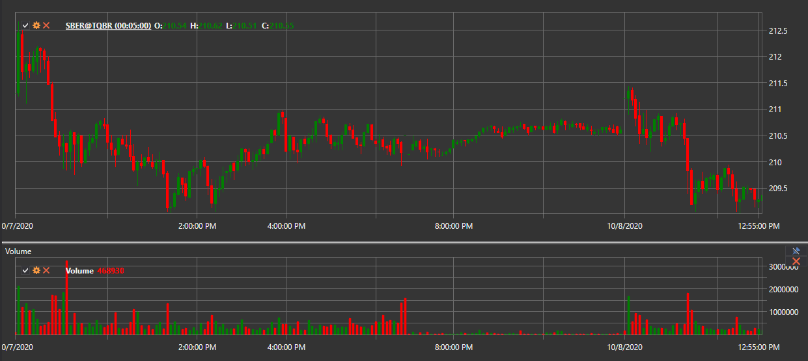
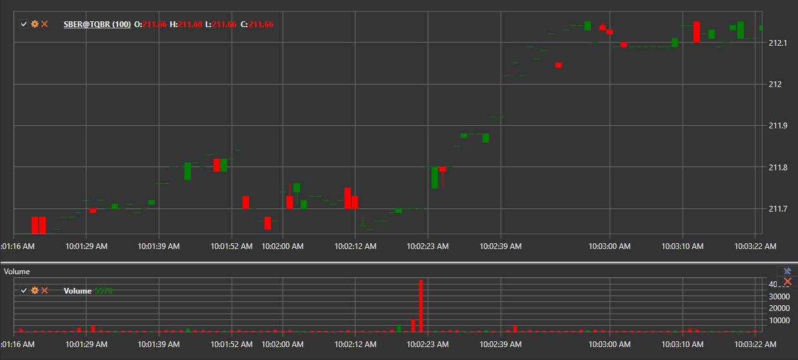

# Kerzenerzeugung

[Hydra](../../hydra.md) ermöglicht die Erzeugung verschiedener Kerzentypen auf Basis heruntergeladener Trades. Diese können anschließend in die Formate [Excel](https://en.wikipedia.org/wiki/Excel), XML, SQL, BIN, JSON oder TXT exportiert werden.

Dadurch können Sie die erzeugten Daten in beliebigen Programmen für technische Analyse verwenden (WealthLab, AmiBroker usw.).

## Prozess der Kerzenerzeugung

1. Klicken Sie auf der Registerkarte **Allgemein** auf die Schaltfläche **Kerzen**. Das folgende Fenster wird geöffnet:

   

2. Im geöffneten Fenster müssen Sie die Parameter für die Kerzenerzeugung konfigurieren:

   - Wählen Sie den gewünschten Kerzentyp aus der Dropdown-Liste aus (alle [Standardkerzentypen](../../api/candles.md) werden unterstützt).
   - Geben Sie die erforderlichen Parameter für den ausgewählten Kerzentyp an:
     - Für [TimeFrameCandleMessage](xref:StockSharp.Messages.TimeFrameCandleMessage) - **Zeitrahmen** auswählen.
     - Für [VolumeCandleMessage](xref:StockSharp.Messages.VolumeCandleMessage) - **Volumen** angeben.
     - Für [TickCandleMessage](xref:StockSharp.Messages.TickCandleMessage) - **Anzahl der Ticks** angeben.
     - Für [RangeCandleMessage](xref:StockSharp.Messages.RangeCandleMessage) - **Bereich** angeben.
     - Für [RenkoCandleMessage](xref:StockSharp.Messages.RenkoCandleMessage) - **Blockgröße** angeben.
     - Für [PnFCandleMessage](xref:StockSharp.Messages.PnFCandleMessage) - **P&F-Parameter** angeben.
   - Wählen Sie das Instrument aus, für das Kerzen erzeugt werden sollen.
   - Geben Sie bei Bedarf einen Zeitbereich an.
   - Klicken Sie auf die Schaltfläche , um die Erzeugung zu starten.

### Beispiel für die Zeitrahmen-Kerzenerzeugung

Um 5-Minuten-Kerzen für das Instrument AAPL@NASDAQ zu erzeugen:

1. Wählen Sie den Kerzentyp [TimeFrameCandleMessage](xref:StockSharp.Messages.TimeFrameCandleMessage).
2. Setzen Sie **Zeitrahmen** = 5 min.
3. Wählen Sie das Instrument AAPL@NASDAQ aus.
4. Klicken Sie auf die Suchschaltfläche.

Nach der Datenerzeugung sehen Sie das Ergebnis:

### Beispiel für die Volumen-Kerzenerzeugung

Um Volumenkerzen zu erzeugen:

1. Wählen Sie den Kerzentyp [VolumeCandleMessage](xref:StockSharp.Messages.VolumeCandleMessage).
2. Geben Sie das Volumen an, zum Beispiel 100.
3. Wählen Sie das Instrument aus.
4. Wählen Sie im Feld **Erstellen aus** den Wert **Ticks**.
5. Klicken Sie auf die Suchschaltfläche.

Ergebnis der Erzeugung:

## Datenquellen für die Kerzenerstellung

Wenn Marktdaten nicht direkt aus der Quelle abgerufen werden konnten, können Sie Kerzen erzeugen, indem Sie im Feld [**Erstellen aus**](any_market_data_types.md) den Datentyp auswählen, aus dem sie erstellt werden:

- **Ticks** - Kerzen aus Tick-Daten erstellen.
- **Orderbücher** - Kerzen aus Orderbuchdaten erstellen.
- **Level1** - Kerzen aus Level1-Daten erstellen.
- **Kleinerer Zeitrahmen** - Kerzen mit größerem Zeitrahmen aus Kerzen mit kleinerem Zeitrahmen erstellen.

### Beispiele verschiedener Erstellungsoptionen:

- 10-Minuten-Kerzen aus Ticks:

  

- 30-Minuten-Kerzen aus 5-Minuten-Kerzen:

  

> [!TIP]
> Wenn Sie im Feld **Erstellen aus** den Wert **nicht erstellen** auswählen, werden nur fertige Kerzen gesucht, die direkt über die Datenquelle heruntergeladen wurden.

## Visualisierung erzeugter Kerzen

Zur grafischen Anzeige erzeugter Kerzen:

1. Klicken Sie auf die Schaltfläche .
2. Ein Chart mit den erstellten Kerzen wird geöffnet:

   

   

## Indikatoren zum Chart hinzufügen

Technische Indikatoren können zum Kerzenchart hinzugefügt werden:

1. Öffnen Sie das Kontextmenü durch Rechtsklick auf das Chartpanel.
2. Wählen Sie den Eintrag **Indikator** und den gewünschten Indikator aus der Liste aus.
3. Um den Indikator in einem separaten Panel anzuzeigen:
   - Fügen Sie über die Schaltfläche  ein neues Panel hinzu.
   - Wählen Sie den gewünschten Indikator im Kontextmenü aus.

Beispiel für ein Chart mit hinzugefügten Indikatoren:

## Datenexport

Die erhaltenen Kerzenwerte können [in verschiedene Formate exportiert](export_data.md) werden, um sie in anderen Programmen zu verwenden.

**Siehe auch das [Video-Tutorial](../videos/building_candles.md) zum Erstellen verschiedener Kerzentypen**
