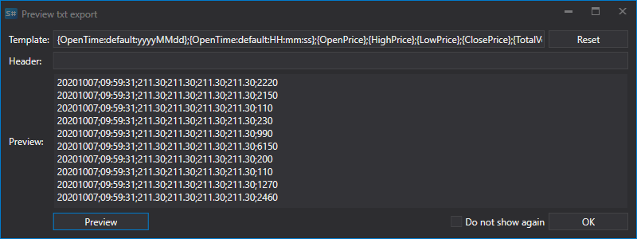

# Daten exportieren

[Hydra](../../hydra.md) ermöglicht den Export empfangener Marktdaten in verschiedene Formate, einschließlich [MetaStock-Datenformate](export_data/export_into_metastock.md).

Für den Export werden Dateien in den Formaten [Excel](https://en.wikipedia.org/wiki/Excel), xml, bin, txt, Json oder SQL-Tabellen verwendet.

Für den Export sollten Sie das erforderliche Dateiformat aus der Dropdown-Liste auswählen:

Danach müssen Sie einen Ordner auswählen und bei Bedarf den Dateinamen ändern.

Beim Export in Textdateien (txt) erscheint ein Fenster, in dem Sie die Exportvorlage in folgender Form angeben können:

**{OpenTime:default:yyyyMMdd};{OpenTime:default:HH:mm:ss};{OpenPrice};{HighPrice};{LowPrice};{ClosePrice};{TotalVolume}**

Hier werden in geschweiften Klammern die zu exportierenden Eigenschaften und deren Reihenfolge angegeben, getrennt durch Semikolons.

Durch Klicken auf die Schaltfläche **Vorschau** können Sie sehen, welche Daten in der Datei gespeichert werden.

Der Benutzer kann zusätzliche Eigenschaften wie den Instrumentcode über die Eigenschaft **{SecurityId.SecurityCode}** hinzufügen oder einen Zeitrahmenwert angeben.

Sie können eine Kopfzeile mit den Eigenschaftsnamen hinzufügen. In diesem Fall sieht der Datensatz wie folgt aus.

Wenn Sie in ein Format exportieren müssen, das Doppelpunkte verwendet, sollten Sie das Schlüsselwort default wie im obigen Beispiel angeben: **{OpenTime:default:HH:mm:ss}**.

**Sehen Sie sich das [Video-Tutorial](../videos/saving_format.md) an**
