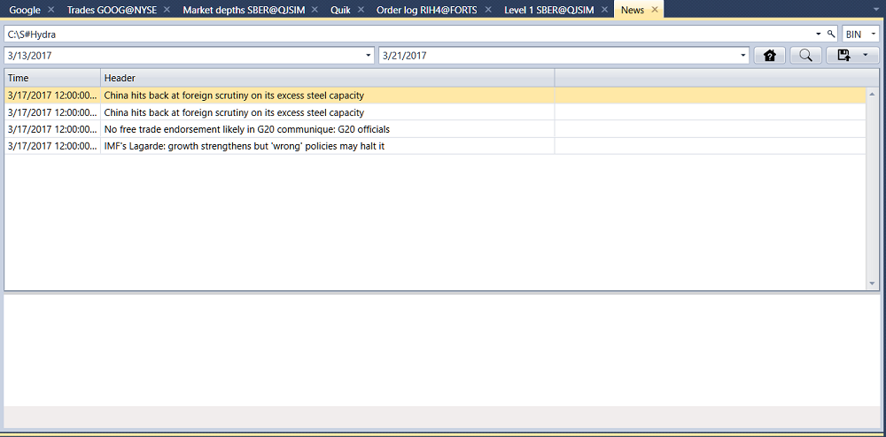

# Nachrichten

Wählen Sie im erscheinenden Fenster die Instrumente und das erforderliche Zeitintervall aus und klicken Sie auf die Schaltfläche :

Die empfangenen Werte können [in das erforderliche Format exportiert](../export_data.md) werden.
