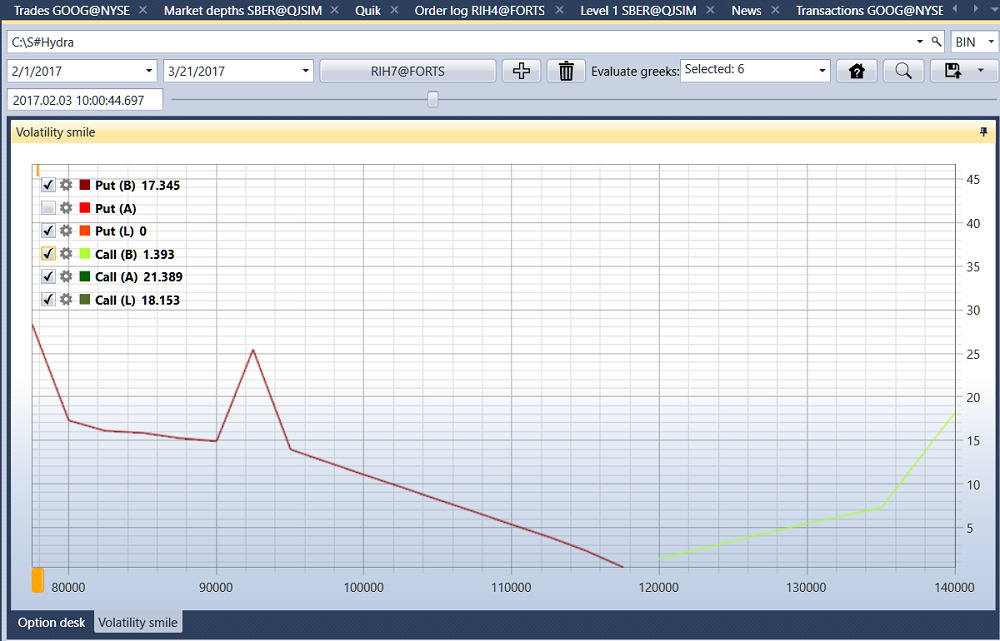

# Option Desk

Wählen Sie im erscheinenden Fenster den gewünschten Zeitbereich aus, wählen Sie den zugrunde liegenden Basiswert, fügen Sie Optionen dafür hinzu und klicken Sie auf die Schaltfläche :

Wenn keine Historie vorhanden ist, aber Daten zum Spread vorliegen, können Sie die wichtigsten Griechen berechnen (Delta, Gamma, Vega, Theta, Rho, Volatility (implied)). Dazu müssen Sie diese im Feld **Griechen berechnen** auswählen.

Um den **Volatilitäts-Smile** anzuzeigen, wechseln Sie zur Registerkarte **Volatilitäts-Smile**.

Die berechneten Werte können [in das erforderliche Format exportiert](../export_data.md) werden.
