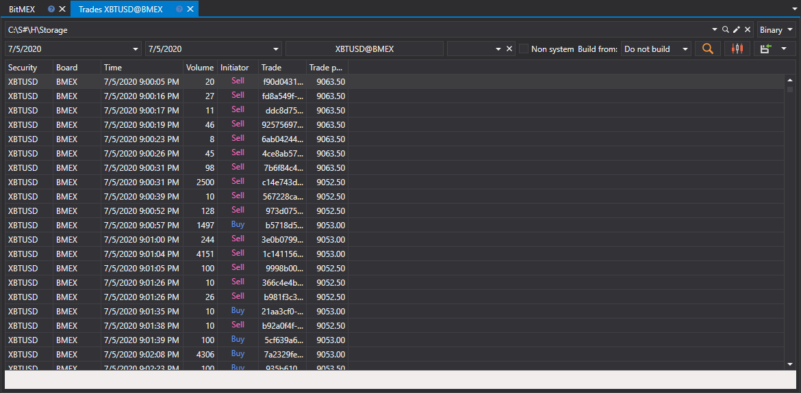

# Ticks

Wählen Sie im angezeigten Fenster die Instrumente und das gewünschte Zeitintervall aus und klicken Sie auf die Schaltfläche :

Um nicht systembezogene Trades zu laden, aktivieren Sie das Kontrollkästchen **Non-system**.

Die empfangenen Werte können [in das erforderliche Format exportiert](../export_data.md) werden.
