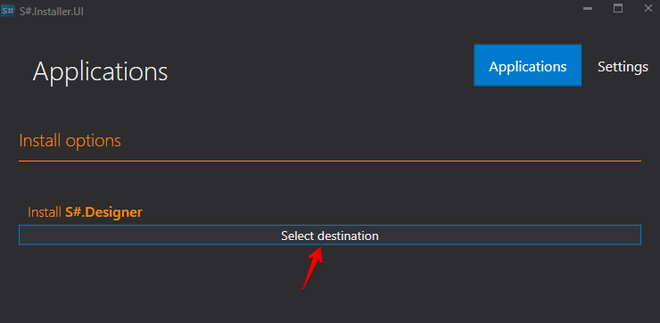
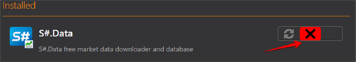

# Apps installieren und entfernen

Mit dem Programm [Installer](../installer.md) können Sie den Anwendungstyp auswählen, um das benötigte Produkt zu finden.

Um die gewünschte Anwendung zu installieren, gehen Sie wie folgt vor:

1. Wählen Sie eine Anwendung aus, klicken Sie auf **Installieren**, akzeptieren Sie die Lizenzvereinbarung und klicken Sie auf **Fortfahren**.
2. Danach müssen Sie den Installationspfad auswählen.

   **WICHTIG\!** Der Ordner, in den das Programm installiert wird, muss leer sein.

   Klicken Sie auf **Fortfahren**.
3. Wählen Sie **Ausführen** und warten Sie, bis die Installation abgeschlossen ist.

Nach Abschluss der Installation ist das Programm einsatzbereit.

Um das Programm zu deinstallieren, wählen Sie **Deinstallieren** und klicken Sie auf die Schaltfläche **Fortfahren**.

Zur Wiederherstellung wählen Sie **Wiederherstellen** und klicken Sie auf **Fortfahren**.

**[Videoanleitung ansehen](videos/install_and_remove_apps.md)**

## Empfohlene Inhalte

[Apps aktualisieren](update_apps.md)
