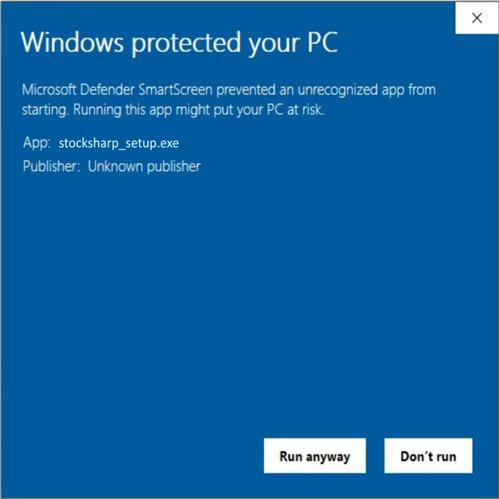

# Erster Start

1. Um den [Installer](../installer.md) zu installieren, öffnen Sie die Seite [Downloadseite](https://stocksharp.com/products/download/):

    

2. Laden Sie die Distribution des [Installer](../installer.md) herunter.
3. Starten Sie die Installationsdatei **stocksharp_setup.exe** und folgen Sie den Anweisungen des Installers.
4. Manchmal startet Windows die Installation nicht sofort und zeigt eine Warnung an:

   

5. Klicken Sie in diesem Fall im Warnfenster auf den Link **Weitere Informationen**. Danach erscheint das folgende Fenster:

    

    Durch Klicken auf **Trotzdem ausführen** wird die Installation des [Installer](../installer.md) gestartet.

6. Anschließend wird der [Installer](../installer.md) entpackt. Warten Sie, bis der Vorgang abgeschlossen ist.
7. Beim ersten Start müssen Sie Ihren **StockSharp**-Login und Ihr Passwort eingeben.

    

    Sie können sich entweder direkt mit Ihren Zugangsdaten oder über die Autorisierung in einem sozialen Netzwerk anmelden. Wenn Sie sich auf der StockSharp-Website über ein soziales Netzwerk registriert haben, besitzen Sie kein Passwort.

8. Nach der Anmeldung wird das Programmfenster geöffnet:

**Sehen Sie sich die [Videoanleitung](videos/setup.md) an**

## Siehe auch

[Programme installieren und entfernen](install_and_remove_apps.md)
