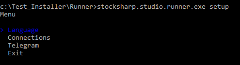
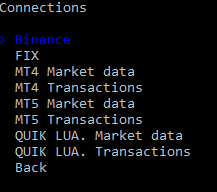
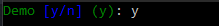
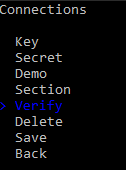

# Verbindung einrichten

Zusätzlich zum [Exportieren von Einstellungen über Designer](export_from_designer.md) bietet **Runner** die Möglichkeit, das Programm über seine Konsolenoberfläche zu konfigurieren. Führen Sie dazu das Programm mit dem Befehl **setup** aus:

```cmd
stocksharp.studio.runner setup
```

Ein Menü erscheint:



Wenn Sie den Menüpunkt Connections auswählen, wechselt das Programm in den Modus zur Einrichtung des Connectors:


Hier können Sie entweder eine zuvor gespeicherte Verbindung bearbeiten oder eine neue erstellen:



Nach Auswahl des erforderlichen Typs der neuen Verbindung wechselt das Programm in das Bearbeitungsmenü für deren Einstellungen:


Für [Binance](../api/connectors/crypto_exchanges/binance.md) müssen die Haupteinstellungen eingegeben werden:




Um die Richtigkeit der eingegebenen Daten zu prüfen, wählen Sie **Prüfen**:



Die Verbindungsprüfung wird gestartet:


Bei Erfolg wird eine Meldung angezeigt:


Nachdem alle Einstellungen eingegeben und geprüft wurden, müssen Sie **Speichern** drücken:


Im Ordner Data wird eine Datei **connector.json** erstellt (falls sie nicht bereits vorhanden war), die die gespeicherten Einstellungen enthält.

Um die Integration mit [Telegram](../telegram_services.md) einzurichten, wählen Sie den Menüpunkt:


Und authentifizieren Sie sich mit einer geeigneten Methode:


Für die Authentifizierung per Token geben Sie das Token von [https://stocksharp.ru/profile/](https://stocksharp.ru/profile/) ein:


Bei Erfolg zeigt das Programm die verfügbaren Telegram-Optionen an:


