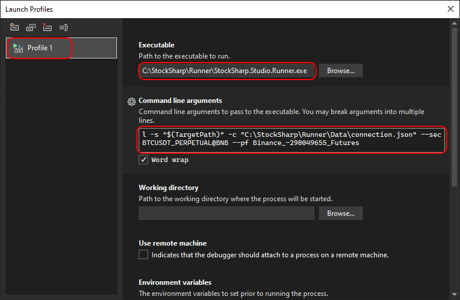

# Integration mit Visual Studio

**Runner** kann ähnlich wie [Designer](../designer/strategies/using_dll/debug_dll_in_visual_studio.md) als Werkzeug zum Debuggen von Strategien verwendet werden. Das ist praktisch, wenn die Strategie ausschließlich in **Runner** ausgeführt werden soll. Andernfalls ist es bequemer, die Strategie im Programm [Designer](../designer.md) zu starten und dort mit ihr zu arbeiten.

Um den Debugging-Prozess einzurichten, führen Sie die folgenden Schritte aus:

1. Klicken Sie mit der rechten Maustaste auf das Handelsstrategieprojekt und wählen Sie im Kontextmenü **Properties**:


Suchen Sie auf der geöffneten Registerkarte den Punkt **Debug**, wählen Sie den Abschnitt **General** aus und klicken Sie auf **Open debug launch profiles UI**.

2. Erstellen Sie anschließend im geöffneten Fenster ein neues Debugging-Profil mit dem Start eines externen Programms:


3. Geben Sie den vollständigen Pfad zu **Runner** ein und legen Sie die Befehlszeilenparameter für den Start fest. Mehr dazu in der [Runner-Befehlszeile](command_line.md).



Befehlszeilenargumente für das Beispiel:

```cmd
l -s "$(TargetPath)" -c "C:\StockSharp\Runner\Data\connection.json" --sec BTCUSDT_PERPETUAL@BNB --pf Binance_-298049655_Futures
```

$(TargetPath) - ist ein spezielles **Visual Studio**-Makro, das beim Debugging-Start automatisch durch den Pfad zur kompilierten DLL mit der Strategie ersetzt wird.

4. Schließen Sie das Fenster mit den Projekteinstellungen und starten Sie das Debugging des Projekts (zum Beispiel mit F5). Das Programmfenster von **Runner** erscheint und zeigt den Verbindungsprozess zum Handel an:


5. Beim Setzen von Haltepunkten hält die Programmausführung an, sobald diese erreicht werden. Zum Beispiel zum Debuggen der Handelslogik, wenn eine neue Kerze erscheint:


