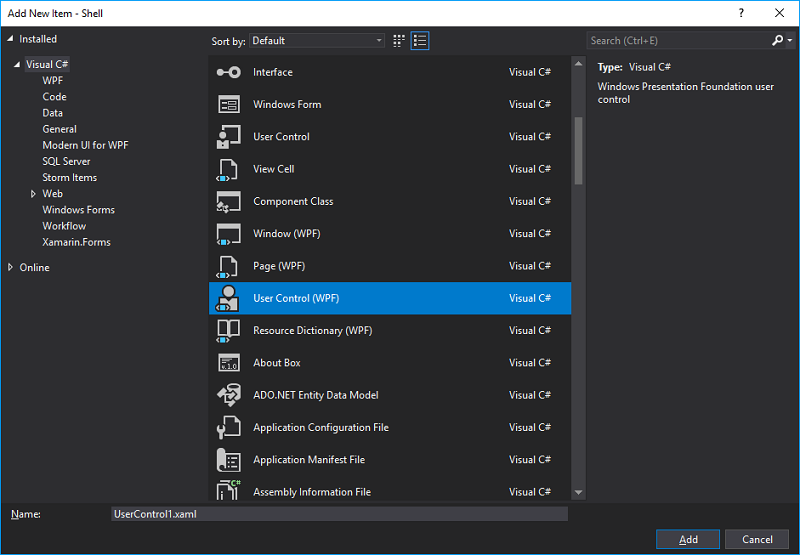

# Strategiepanel erstellen

Benutzerdefinierte Panels sind spezielle Steuerelemente, die von S# erstellt wurden, um die Arbeit mit DevExpress-Elementen zu erleichtern.

Zuerst müssen Sie im XAML-Ordner Ihrer Strategie ein einfaches UserControl erstellen.




Ersetzen Sie `UserControl` durch `controls:BaseStudioControl`.

```xaml
<controls:BaseStudioControl>
...
</controls:BaseStudioControl>

```

Implementieren Sie anschließend Ihre eigene Panel-Logik ähnlich wie bei den vorhandenen Strategiepanels.

Damit das Panel [Echtzeit](user_interface/real_time.md) die Strategie in Ihrem Panel sehen kann, muss Ihre Strategie als Eigenschaft gesetzt werden:

```cs
	public partial class SmaMonitoringControl
	{
	...
		public Strategy Strategy { get; set; }
	...
	}

```

Um die Strategieeinstellungen zu speichern, müssen Sie im Panel die Methoden **Load** und **Save** überschreiben.

```cs
	public partial class SmaMonitoringControl
	{
	...
		public override void Load(SettingsStorage storage)
		{
			base.Load(storage);
			try
			{
				Strategy = MainWindow.Instance.CreateStrategy(storage.GetValue<SettingsStorage>(nameof(Strategy)));
				Init(Strategy);
			}
			catch (Exception e)
			{
				e.LogError();
			}
		}
		public override void Save(SettingsStorage storage)
		{
			base.Save(storage);
			storage.SetValue(nameof(Strategy), Strategy.Save());
		}
	...
	}

```

## Empfohlene Inhalte

[Strategie erstellen](create_strategy.md)
