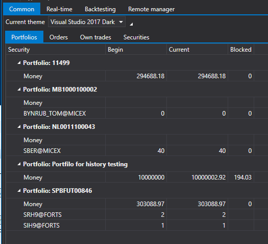
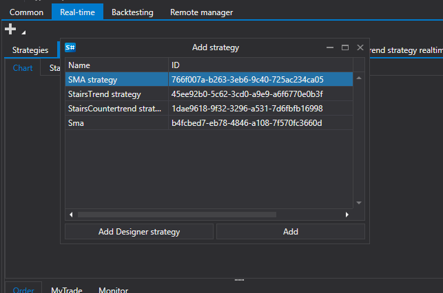

# Schnellstart

[Shell](../shell.md) ist auf die Programmierung in der Sprache [C#](https://en.wikipedia.org/wiki/C_Sharp_(programming_language)) in Visual Studio oder einer ähnlichen Umgebung ausgerichtet.

Wenn Sie das Projekt [Shell](../shell.md) starten, zeigt der Solution Explorer das Shell-Projekt an:

Der Ordner **Strategien** enthält drei in [Shell](../shell.md) enthaltene Strategien, eine Shell für Standardstrategien sowie einige Hilfsschnittstellen.

Das Projekt kann ohne vorherige Vorbereitung gestartet werden, um zu sehen, wie es mit den bereits in [Shell](../shell.md) enthaltenen Strategien arbeitet.

Nach dem Start sehen wir ein Fenster wie dieses:

Die Verbindungseinstellungen und Verbindungsschaltflächen sowie die Schaltfläche zum Speichern der aktuellen Shell-Konfiguration befinden sich oben auf dem Bildschirm. Dort befinden sich auch die Hauptregisterkarten.

Öffnen Sie die Verbindungseinstellungen und wählen Sie die erforderliche Verbindung aus. Wie eine Verbindung eingerichtet wird, ist unter [Verbindungseinstellungen](connections_settings.md) beschrieben.

Der nächste Schritt ist die Verbindung durch Klicken auf die Schaltfläche **Verbinden** .

Nach dem Verbindungsaufbau sehen Sie auf der Registerkarte [Allgemein](user_interface/common.md) die Portfolios, Instrumente, Orders und eigenen Trades, die von der Verbindung empfangen wurden.

Wechseln Sie zur Registerkarte Echtzeit und klicken Sie auf die Schaltfläche **Hinzufügen** , um eine Strategie für den Handel hinzuzufügen.

Nachdem die Strategie hinzugefügt wurde, füllen Sie ihre Basisparameter wie **Instrument**, **Portfolio** usw. aus. Klicken Sie auf die Schaltfläche Strategie starten, um sie zu starten.

Ähnlich wie auf der Registerkarte [Echtzeit](user_interface/real_time.md) können Sie auf der Registerkarte [Emulation](user_interface/emulation.md) einen Strategietest auf historischen Daten ausführen.

