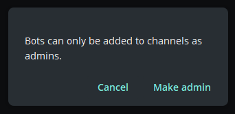
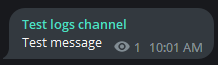

# Benachrichtigungen

Ein Dienst zum Senden von Nachrichten aus Anwendungen (zum Beispiel [Designer](../designer.md) oder einem eigenen benutzerdefinierten Programm) an private und öffentliche Kanäle oder Gruppen im Telegram-Messenger.

Zur Konfiguration:

1. Schließen Sie den [Autorisierungsprozess für den Bot](authorization.md) ab.

2. Erstellen Sie einen Kanal oder eine Gruppe (privat oder öffentlich).

   
   

3. Fügen Sie den Bot [StockSharpBot](https://t.me/StockSharpBot) hinzu.

   

4. Machen Sie ihn zum Administrator.

   

5. Erforderliche Berechtigungen für den korrekten Betrieb.

   

6. Schreiben Sie das spezielle Wort **activate** in den Kanal oder die Gruppe.

   

7. Bei Erfolg erhalten Sie eine Antwort.

   

Der von Ihnen erstellte Kanal ist nun für Ihre Strategien und Handelsroboter verfügbar:

  - Wenn Sie [Designer](../designer.md) verwenden, klicken Sie in der oberen Leiste auf die Kanalliste:

  

  Im angezeigten Fenster sehen Sie Listen aller Kanäle und Gruppen, in denen Sie den Bot aktiviert haben:

  

  Durch Drücken der Telegram-Symbolschaltfläche wird eine Testnachricht gesendet. Wenn sie empfangen wird, ist alles korrekt eingerichtet.

  

  *Im kostenlosen Tarif wird eine Zeile mit Hinweis auf die StockSharp-Website hinzugefügt. In kostenpflichtigen Tarifen wird diese Zeile entfernt.*

Wenn Sie mehrere Ausgabekanäle in Telegram haben und verschiedene Strategien auf separate Kanäle leiten möchten, können Sie die Kanäle für jede Strategie in den Einstellungen angeben:

- In anderen Programmen werden die Einstellungen ähnlich wie in [Designer](../designer.md) vorgenommen. Zum Beispiel können Sie im Programm [Hydra](../hydra.md) die Fehlerprotokollierung für das Herunterladen von Marktdaten konfigurieren, wenn [Hydra](../hydra.md) auf einem Server läuft und Sie zeitnah Informationen über eine nicht funktionierende Verbindung erhalten müssen.
- Bei [Shell](../shell.md) oder [S#](../api.md) können Sie den Code ansehen, der Ihre Strategien mit dem Telegram-Dienst integriert.
