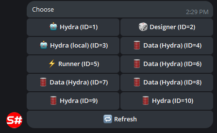
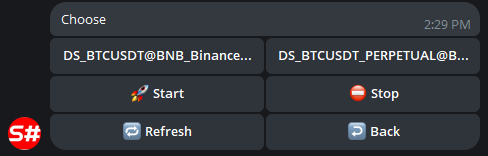

# Bedienfeld

Ein Dienst zur Verwaltung von Handelsstrategien und Robotern über einen Telegram-Bot.

Gehen Sie für die Einrichtung vorher durch den [Autorisierungsprozess für den Bot](authorization.md).

Danach ist der Bot einsatzbereit. Damit der Bot Ihre Strategien sehen kann, müssen Sie anschließend:

 - Bei Verwendung des Programms [Designer](../designer.md) im Cloud-Panel den Fernmodus aktivieren:

  

  Alle Strategien, die im Live-Modus laufen, werden automatisch an den Telegram-Bot übertragen, und Sie können sie von Ihrem Telefon aus steuern.

  Wählen Sie in [StockSharpBot](https://t.me/StockSharpBot) den Befehl /apps aus, um eine Liste aller Programme zu sehen:

  

  Nachdem das gewünschte Programm ausgewählt wurde, können Sie die Strategien und ihre Steuerelemente sehen:

  

  

  

 - Bei Verwendung von [Shell](../shell.md) öffnen Sie das Panel RemoteManager und konfigurieren die Einstellungen ähnlich wie in [Designer](../designer.md).
 - Bei Verwendung von [Hydra](../hydra.md) führen Sie ähnliche Aktionen wie in [Designer](../designer.md) aus. Die Integration mit [Hydra](../hydra.md) ermöglicht das Verwalten des Marktdaten-Downloads und das Überwachen quantitativer Statistiken.

  
  

 - Bei Verwendung von [S#](../api.md) können Sie die Integration mithilfe des Codes aus [Shell](../shell.md) vornehmen. Da [S#](../api.md) plattformübergreifend ist, können Ihre Roboter auf jedem Betriebssystem laufen.
