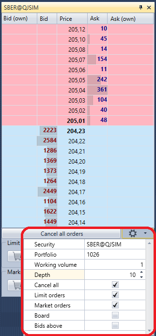
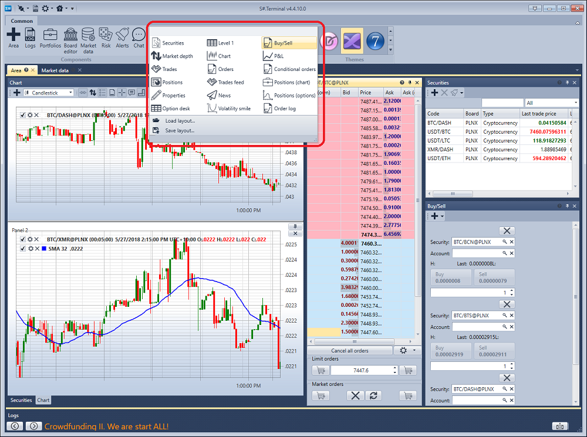

# Schnellstart

Wenn Sie [Terminal](../terminal.md) zum ersten Mal starten, wird folgendes Fenster angezeigt:

Sie müssen den Startmodus auswählen und auf **OK** klicken.

Nach der Auswahl des Startmodus öffnet sich das Terminalfenster mit dem Standardsatz an Komponenten.

Wechseln Sie zu den Verbindungseinstellungen und wählen Sie die benötigte Verbindung aus. Die Einrichtung der Verbindung wird im Abschnitt [Verbindungseinstellungen](connection_settings.md) beschrieben.

Der nächste Schritt besteht darin, die Verbindung über die Schaltfläche **Connect**  herzustellen.

Durch Klicken auf die Schaltfläche **Add**  im Chart-Panel fügen Sie einen neuen Chart-Bereich hinzu. Mit einem Rechtsklick in den Chart-Bereich fügen Sie Kerzen für das gewünschte Instrument hinzu. Sie können dem Chart Indikatoren, eigene Trades und Orders hinzufügen. Außerdem können Orders direkt aus dem Chart registriert werden. Weitere Informationen zur Arbeit mit dem Chart finden Sie im Abschnitt [Chart](user_interface/components/chart.md).

Durch Klicken auf die Schaltfläche **Add**  im Instrument-Panel fügen Sie die Instrumente hinzu, die Sie beobachten möchten. Hier werden die besten Preisdaten angezeigt. Weitere Informationen zur Arbeit mit dem Instrument-Panel finden Sie im Abschnitt [Instrumente](user_interface/components/instruments.md).

Wenn Sie im Orderbuch auf die Schaltfläche **Settings**  klicken, erscheint ein Panel, in dem Sie das **Instrument** und das **Portfolio** für Trades angeben können. Hier können Sie außerdem die Tiefe des Orderbuchs anpassen. Weitere Informationen zur Arbeit mit einem Orderbuch finden Sie im Abschnitt [Orderbuch](user_interface/components/order_book.md).

Registrieren wir die ersten Orders. Orders können entweder über die Schaltflächen **Buy/Sell** oder durch Klicken auf die Zellen in den Spalten **Bid/Offer** des Orderbuchs registriert werden. Das Order-Panel zeigt alle Ihre Orders an. Wenn Sie mit der rechten Maustaste auf eine Order klicken, erscheint ein Panel, über das Sie eine neue Order senden, die ausgewählte Order stornieren oder ändern können. Weitere Informationen zur Arbeit mit dem Order-Panel finden Sie im Abschnitt [Orders](user_interface/components/orders.md).

Im Trades-Panel können Sie Trades nach Instrumenten anzeigen. Weitere Informationen zur Arbeit mit dem Trades-Panel finden Sie im Abschnitt [Trades](user_interface/components/trades.md).

Bei Bedarf können Sie zusätzliche Komponenten hinzufügen. Alle Komponenten werden im Abschnitt [Komponenten](user_interface/components.md) beschrieben.

