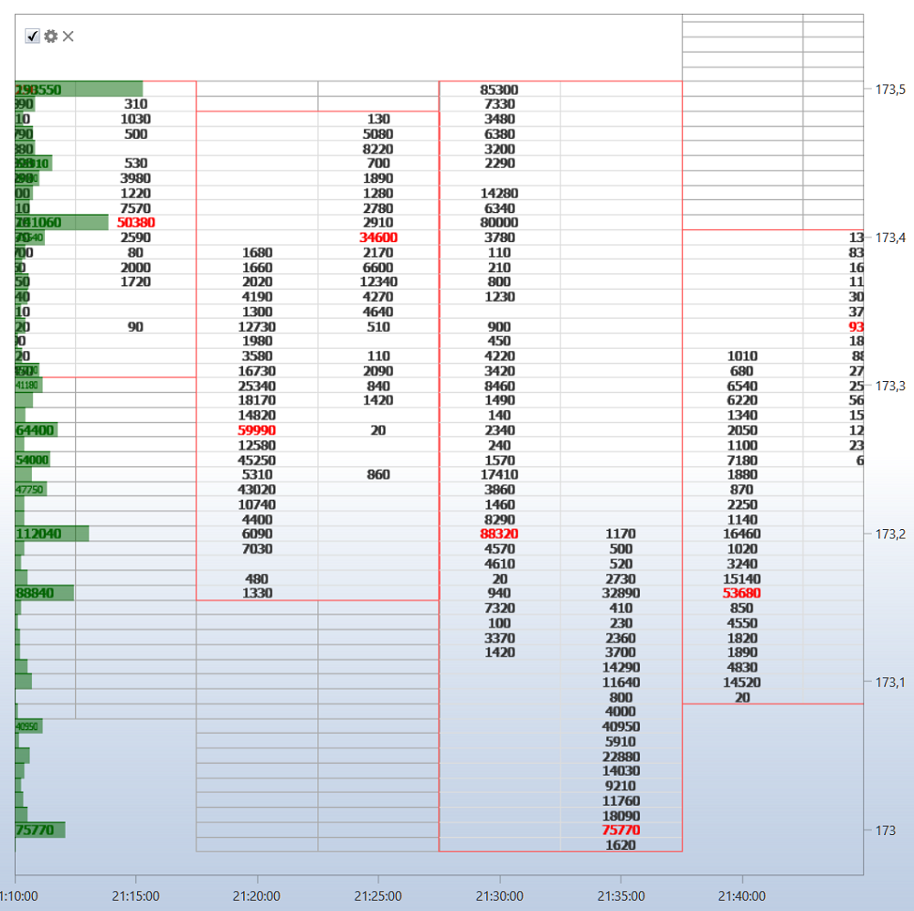

# Chart

Die Komponente **Chart** ermöglicht das Zeichnen von Kerzen und Indikatoren für das ausgewählte Instrument.

Um einen neuen Bereich hinzuzufügen, klicken Sie auf die Schaltfläche .

Um dem Chart ein neues Element hinzuzufügen, klicken Sie mit der rechten Maustaste an eine beliebige Stelle im Chart-Bereich und wählen Sie das benötigte Element aus; verfügbar sind unter anderem Kerzen, Indikatoren, Orders und eigene Trades.

In der oberen linken Ecke jedes Charts werden alle grafischen Elemente angezeigt, die dem Chart hinzugefügt wurden. Wenn Sie das Kontrollkästchen  für ein grafisches Element deaktivieren, wird dieses Element auch aus dem Chart entfernt.

Ein Klick auf  öffnet die Einstellungen für das grafische Element.

Sie können Orders aus dem Chart heraus registrieren. Geben Sie dazu zuerst das **Instrument** und das **Portfolio** an, für die Orders registriert werden sollen.

Kauforders werden mit der Tastenkombination **Ctrl+linke Maustaste** registriert.

Verkaufsorders werden mit der Tastenkombination **Ctrl+rechte Maustaste** registriert.

In den Einstellungen des grafischen Elements können Sie den benötigten Chartstil festlegen: japanische Kerzen, Balken, Box-Chart, Cluster-Profil usw.

Bei einem Box-Chart können Kerzen zusätzlich gruppiert werden; die Gruppierungsreihenfolge wird in den Feldern für den Multiplikator des 2. Zeitrahmens und den Multiplikator des 3. Zeitrahmens festgelegt.

Über dem Chart befindet sich eine Toolbar, in der Sie Auto-Scroll, Auto-Zoom, Legendenmodi und andere allgemeine Chart-Einstellungen auswählen können. Außerdem können Sie die Elemente auswählen, die im Chart gezeichnet werden sollen: Linien, Levels, Zeiger, Rechteck, Text.

## Siehe auch

[Orders](../../../designer/user_interface/components/orders.md)
