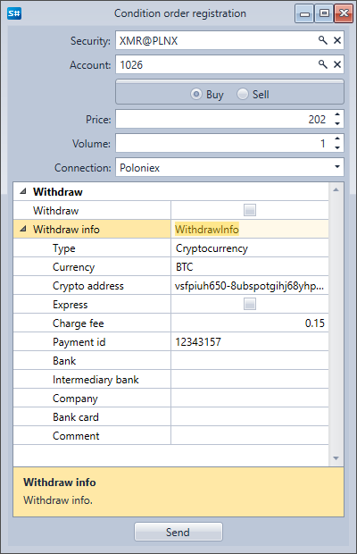

# Conditional orders

Die Komponente **Conditional orders** ist eine Tabelle mit Orders, die vollständige Informationen über alle bedingten Orders anzeigt. Wenn Sie mit der rechten Maustaste auf eine Order klicken, erscheint ein Panel, über das Sie eine neue bedingte Order registrieren, die ausgewählte bedingte Order stornieren oder ändern können.

Wenn Sie auf die Schaltfläche **Order Registration** klicken, erscheint ein Fenster. Um eine neue bedingte Order zu registrieren, füllen Sie es aus und klicken Sie auf **Send**.

Wenn Sie auf die Schaltfläche **Change Order** klicken, erscheint ein Fenster. Um die bedingte Order zu ändern, nehmen Sie die erforderlichen Änderungen vor und klicken Sie auf **Send**.

## Empfohlene Inhalte

[Trades](../../../designer/user_interface/components/trades.md)
