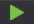

# UDP Dumper

**UDPDumper** zeichnet UDP-Pakete auf. Er kann verwendet werden, um Netzwerkeinstellungen zu prüfen, die von einem Broker oder einer Börse bereitgestellt wurden, und um Daten für spätere Tests UDP-basierter Connectors wie [FAST](api/connectors/common/fast_protocol.md) oder SBE zu sammeln.

Installieren Sie UDPDumper über [Installer](installer.md).

## Einrichtung und Start

1. Beim ersten Start zeigt die App Folgendes an:
2. Um Netzwerk-Feeds hinzuzufügen, fügen Sie sie entweder manuell hinzu oder laden alle Feeds aus den Konfigurationsdateien der Börse. Klicken Sie dazu auf die Schaltfläche:
3. Im angezeigten Fenster müssen Sie die gewünschte Konfigurationsdatei der Börse suchen und öffnen:
4. Alle Feeds mit IP-Adressen und Porteinstellungen werden aus einer Datei geladen:
5. Wählen Sie die benötigten Feeds aus und klicken Sie auf die Schaltfläche zum Starten des Downloads:
6. Wenn die Einstellungen korrekt sind, beginnt das Programm, UDP-Datagramme zu empfangen und auf die Festplatte zu schreiben. Die App zeigt die Anzahl der für jeden Feed empfangenen Bytes an:
7. **UDPDumper** verfügt über eine grafische Oberfläche. Wenn Sie es ohne grafische Oberfläche ausführen müssen, zum Beispiel unter Linux, verwenden Sie **UDPDumper.Console**, die plattformübergreifende Konsolenversion.

   Die App **UDPDumper.Console** erwartet als Parameter den Pfad zu der Datei, die von der UI-Version erstellt wurde (genau von der UI-Version und **nicht zu einer Börsenkonfiguration**):

   ```cs
   		StockSharp.UdpDumper.Console.exe settings.json

   ```
8. Um einen Connector mit den gesammelten Daten zu testen, verwenden Sie den Dump-Modus. Details finden Sie unter [Dump-Modus](api/connectors/common/fast_protocol/dump_mode.md).
