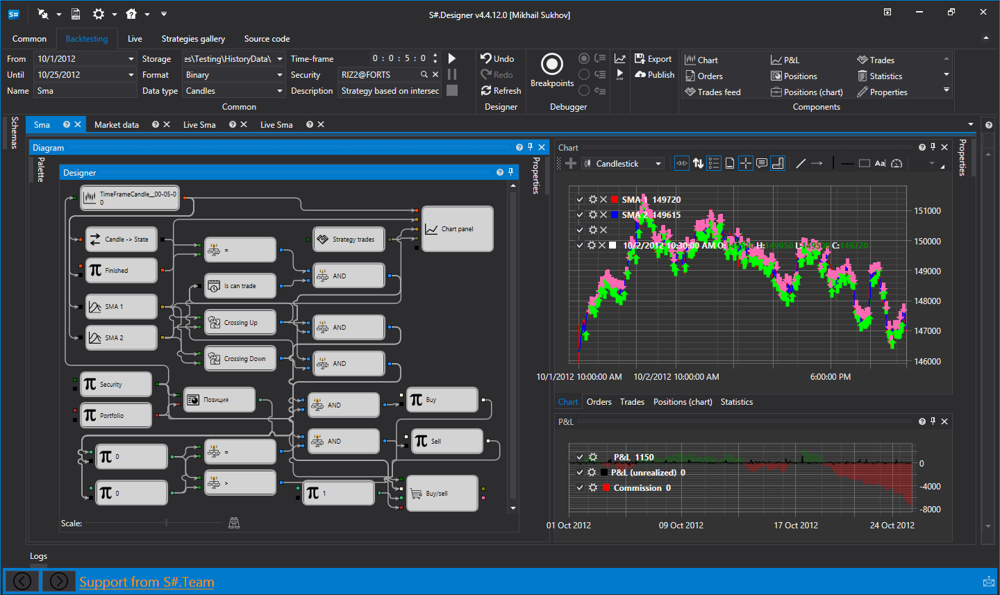

# About StockSharp

[StockSharp (shortly S\#)](https://stocksharp.com/products/) \- are **free** programs for trading at any markets of the world (American, European, Asian, Russian, stocks, futures, options, Bitcoins, forex, etc.). You will be able to trade manually or automated trading (algorithmic trading robots, conventional or HFT). 

**Supports 90+ brokers, exchanges and data sources:** [Connectors](topics/API_Connectors.md).

You can use S\# with any broker that supports our connection.

> [!IMPORTANT]
> The installation of **all** programs is performed uniformly through the [Installer](topics/SharpInstaller.md) utility.

### Designer

Designer

[Designer](topics/Designer.md) \- universal algorithmic strategies application for easy strategy creation: 

- Visual designer to create strategies by mouse clicking.
- Embedded [C\#](https://en.wikipedia.org/wiki/C_Sharp_(programming_language)) editor.
- Easy to create own indicators.
- Build in debugger.
- Connections to the multiple electronic boards and brokers.
- All world platforms.
- Schema sharing with own team.

[More...](topics/Designer.md)

### Hydra

Hydra

[Hydra](topics/Hydra.md) \- the program for automatic download of historical and real\-time market data: 

- Supports many sources [Connectors](topics/API_Connectors.md).
- High compression ratio (2 bytes per trade, 7 bytes per order book).
- Any data type (candles, ticks, order book, order\-log, options, news and other).
- Program access to stored data via API.
- Export to csv, excel, xml or database.
- Import from csv.
- Scheduled tasks.
- Auto\-sync over the Internet between several running programs Hydra.

[More...](topics/Hydra.md)

### Terminal

Terminal

[Terminal](topics/Terminal.md) \- trading charting application (trading terminal).

- Trading from charts by clicking
- Arbitrary timeframes
- Volume, Tick, Range, Renko candles
- Cluster and box charts

### Shell

Shell

The ready\-made graphical framework with the ability to quickly change to your needs and with fully open source code in C\#

- Complete source code
- Support for all StockSharp platform connections: FIX\/FAST, Crypto Exchange (+30 at the moment), etc.
- Support for Designer schemas
- Flexible user interface
- Strategy testing (statistics, equity, reports)
- Save and load strategy settings
- Launch strategies in parallel
- Detailed information on strategy performance (orders, transactions, position, revenue, logs, etc.)
- Launch strategies on schedule

### API

API

[API](topics/StockSharpAbout.md) \- library for the professional development of trading robots in C\#. For those who are programming in Visual Studio, and is a professional programmer in algotrading. 

### All our products:

All our products:

- [Designer](topics/Designer.md) \- universal algorithmic strategies designer.
- [Hydra](topics/Hydra.md) \- program to download market data.
- [API](topics/StockSharpAbout.md) \- library for writing trading robots on [C\#](https://en.wikipedia.org/wiki/C_Sharp_(programming_language)).
- [Terminal](topics/Terminal.md) \- trading terminal.
- [Shell](topics/Shell.md) \- ready\-made graphical framework for strategies with source codes.
- [MatLab](topics/MatLab.md) \- MatLab integration with trading systems. Trade from MatLab scripts.

[Download](https://stocksharp.com/products/download/)

## Recommended content

[Reference materials](topics/Materials.md)
