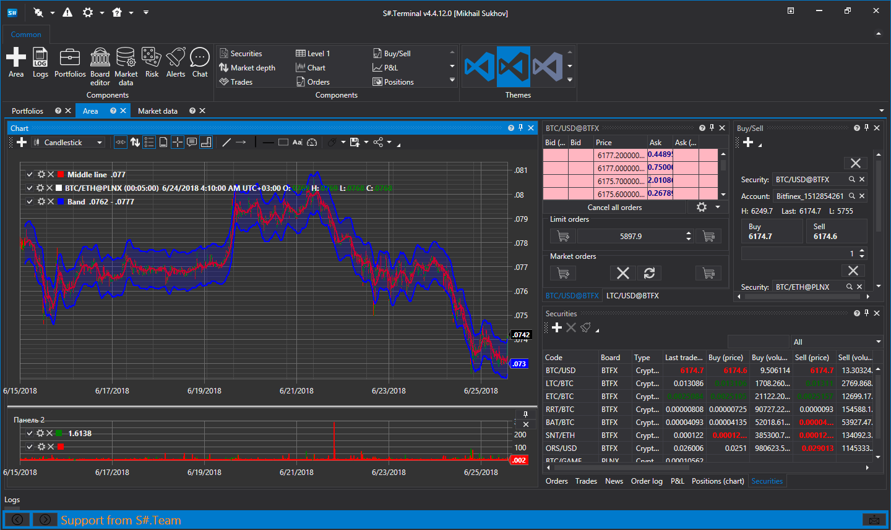

# About StockSharp

[StockSharp (S#)](https://stocksharp.com/store/) offers **free** trading programs for global markets (American, European, Asian, Russian, stocks, futures, options, Bitcoins, forex, etc.). Users can trade manually or through automated trading, including algorithmic trading robots, conventional or HFT (High-Frequency Trading).

**Supports 90+ brokers, exchanges, and data sources:** [Connectors](topics/api/connectors.md).

S# is compatible with any broker that supports our connections.

> [!NOTE]
> The installation of **all** programs is uniformly performed through the [Installer](topics/installer.md) utility.

### Designer

[Designer](topics/designer.md) is a universal algorithmic strategies application that simplifies strategy creation:

- Visual designer for strategy creation using mouse clicks.
- Integrated [C#](https://en.wikipedia.org/wiki/C_Sharp_(programming_language)) editor.
- Simple creation of custom indicators.
- Built-in debugger.
- Connection capabilities to multiple electronic boards and brokers.
- Compatibility with all world platforms.
- Ability to share schemas with your team.

[More...](topics/designer.md)

### Hydra

[Hydra](topics/hydra.md) is an application for the automatic downloading of historical and real-time market data:

- Supports numerous sources [Connectors](topics/api/connectors.md).
- High compression ratio (2 bytes per trade, 7 bytes per order book).
- Handles any data type (candles, ticks, order books, order-logs, options, news, and more).
- API access to stored data.
- Export capabilities to CSV, Excel, XML, or databases.
- CSV import functionality.
- Scheduled tasks and auto-sync over the Internet between running Hydra instances.

[More...](topics/hydra.md)

### Terminal

[Terminal](topics/terminal.md) is a trading and charting application (trading terminal):

- Enables trading directly from charts with a click.
- Supports arbitrary timeframes.
- Features various candle types: Volume, Tick, Range, Renko.
- Includes cluster and box charts.

### Shell

The Shell provides a ready-made graphical framework that can be quickly customized to your needs and comes with fully open source code in C#:

- Complete source code included.
- Supports all StockSharp platform connections: FIX/FAST, Crypto Exchanges (+30 currently), etc.
- Designer schema support.
- Flexible user interface.
- Strategy testing tools (statistics, equity, reports).
- Save and load strategy settings.
- Concurrent strategy execution.
- Detailed strategy performance insights (orders, transactions, positions, revenue, logs, etc.).
- Scheduled strategy launches.

### API

[API](topics/api.md) is a library for the professional development of trading robots in C#. It is designed for those who are programming in Visual Studio and are professional programmers in algorithmic trading.

### Our Products:

- [Designer](topics/designer.md) - Universal algorithmic strategy designer.
- [Hydra](topics/hydra.md) - Market data downloading program.
- [API](topics/api.md) - Library for developing trading robots in [C#](https://en.wikipedia.org/wiki/C_Sharp_(programming_language)).
- [Terminal](topics/terminal.md) - Trading terminal.
- [Shell](topics/shell.md) - Ready-made graphical framework for strategies with source codes.
- [MatLab](topics/matlab.md) - Integration of MatLab with trading systems. Trade from MatLab scripts.

[Download](https://stocksharp.com/products/download/)

## Recommended Content

[Reference Materials](topics/common/reference_materials.md)
