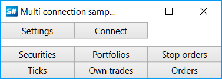

# Connectors

To work with exchanges and data sources in [S\#](StockSharpAbout.md) it is recommended to use the base class [Connector](xref:StockSharp.Algo.Connector). 

Let's consider working with [Connector](xref:StockSharp.Algo.Connector). The example source codes are in the project Samples\/Common\/SampleConnection.



We create an instance of the [Connector](xref:StockSharp.Algo.Connector) class:

```cs
...
public Connector Connector;
...
public MainWindow()
{
	InitializeComponent();
	Connector = new Connector();
	InitConnector();
}
		
```

To configure [Connector](xref:StockSharp.Algo.Connector)**S\#.API** has a special graphical interface in which you can configure several connections at once. How to use it see [Graphical configuration](API_ConnectorsUIConfiguration.md). 

```cs
...
private const string _connectorFile = "ConnectorFile";
...
private void Setting_Click(object sender, RoutedEventArgs e)
{
	if (Connector.Configure(this))
	{
		new XmlSerializer<SettingsStorage>().Serialize(Connector.Save(), _connectorFile);
	}
}
	  				
```


Similarly, you can add connections directly from the code (without graphic windows) using the extension method [TraderHelper.AddAdapter\`\`1](xref:StockSharp.Algo.TraderHelper.AddAdapter``1(StockSharp.Algo.Connector,System.Action{``0})):

```cs
...
connector.AddAdapter<BarChartMessageAdapter>(a => { });
```

You can add an unlimited number of connections to a single [Connector](xref:StockSharp.Algo.Connector) object. Therefore, from the program you can simultaneously connect to several exchanges and brokers at once.

In the *InitConnector* method, we set the required [IConnector](xref:StockSharp.BusinessEntities.IConnector) event handlers:

```cs
private void InitConnector()
{
	// subscribe on connection successfully event
	Connector.Connected += () =>
	{
		this.GuiAsync(() => ChangeConnectStatus(true));
	};
	// subscribe on connection error event
	Connector.ConnectionError += error => this.GuiAsync(() =>
	{
		ChangeConnectStatus(false);
		MessageBox.Show(this, error.ToString(), LocalizedStrings.Str2959);
	});
	Connector.Disconnected += () => this.GuiAsync(() => ChangeConnectStatus(false));
	// subscribe on error event
	Connector.Error += error =>
		this.GuiAsync(() => MessageBox.Show(this, error.ToString(), LocalizedStrings.Str2955));
	// subscribe on error of market data subscription event
	Connector.MarketDataSubscriptionFailed += (security, msg, error) =>
		this.GuiAsync(() => MessageBox.Show(this, error.ToString(), LocalizedStrings.Str2956Params.Put(msg.DataType, security)))
	Connector.NewSecurity += _securitiesWindow.SecurityPicker.Securities.Add;
	Connector.NewTrade += _tradesWindow.TradeGrid.Trades.Add;
	Connector.NewOrder += _ordersWindow.OrderGrid.Orders.Add;
	Connector.NewStopOrder += _stopOrdersWindow.OrderGrid.Orders.Add;
	Connector.NewMyTrade += _myTradesWindow.TradeGrid.Trades.Add;
	
	Connector.NewPortfolio += _portfoliosWindow.PortfolioGrid.Portfolios.Add;
	Connector.NewPosition += _portfoliosWindow.PortfolioGrid.Positions.Add;
	// subscribe on error of order registration event
	Connector.OrderRegisterFailed += _ordersWindow.OrderGrid.AddRegistrationFail;
	// subscribe on error of order cancelling event
	Connector.OrderCancelFailed += OrderFailed;
	// subscribe on error of stop-order registration event
	Connector.OrderRegisterFailed += _stopOrdersWindow.OrderGrid.AddRegistrationFail;
	// subscribe on error of stop-order cancelling event
	Connector.StopOrderCancelFailed += OrderFailed;
	// set market data provider
	_securitiesWindow.SecurityPicker.MarketDataProvider = Connector;
	try
	{
		if (File.Exists(_settingsFile))
		{
			var ctx = new ContinueOnExceptionContext();
			ctx.Error += ex => ex.LogError();
			using (new Scope<ContinueOnExceptionContext> (ctx))
				Connector.Load(new XmlSerializer<SettingsStorage>().Deserialize(_settingsFile));
		}
	}
	catch
	{
	}
	ConfigManager.RegisterService<IExchangeInfoProvider>(new InMemoryExchangeInfoProvider());
	
	// needed for graphical settings
	ConfigManager.RegisterService<IMessageAdapterProvider>(new FullInMemoryMessageAdapterProvider(Connector.Adapter.InnerAdapters));
}
```

To save and load [Connector](xref:StockSharp.Algo.Connector) settings to a file, see [Save and load settings](API_Connectors_SaveConnectorSettings.md).

To create your own [Connector](xref:StockSharp.Algo.Connector), see [Creating own connector](ConnectorCreating.md).

For registering orders, see [Orders management](Orders.md), [Create new order](CreateNewOrder.md), [Create new stop order](API_StopOrders.md). 

## Recommended content

[Graphical configuration](API_ConnectorsUIConfiguration.md)
