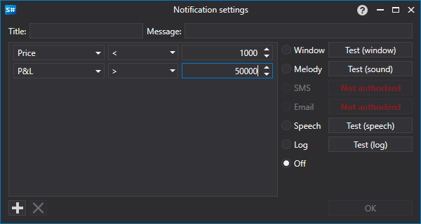

# Notification settings window

[AlertSettingsWindow](../api/StockSharp.Alerts.AlertSettingsWindow.html) \- window for configuring notifications of certain events 

You can configure notifications about changing the following data types: Portfolio, Client code, Broker, Depository, Server time, Transaction, Data type, Cancel, Order ID, Order ID (string), Order ID (platform), Derivative, Derivative (string), Price, Volume (order), Volume (trade), Visible volume, Direction, Balance, Order type, Status, Comment, Order message, System order, Order expiration time, Execution condition, Price, Trade initiator, Open interest, Error, Condition, Uptrend, Commission, Delay, Slippage, Identifier (user), Currency, P\/L, Position, Market maker.

Notifications can be of the following form:

- **Window** \- a small pop\-up window with a message will appear in the corner of the screen.
- **Melody** \- the melody will play.
- **SMS** \- a message will be sent by SMS.
- **Email** \- a message will be sent by email.
- **Speech** \- a message will be spoken by the computer\-generated voice.
- **Log** \- a message will be sent to the Designer Logs window.
- **Disabled** \- a notification will not be displayed.
