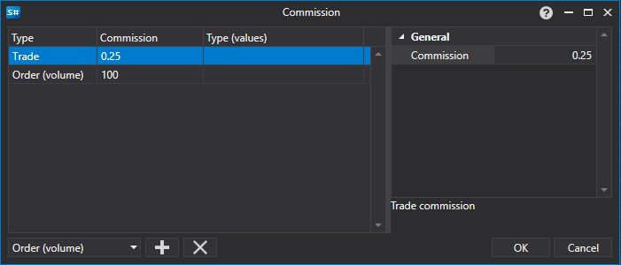

# Commission settings window

[CommissionWindow](../api/StockSharp.Xaml.CommissionWindow.html) \- \- A special window for setting the rules for charging a commission. 



Below is an example of the code to call window for setting the rules for charging a commission. 

```cs
		private void RiskButton\_OnClick(object sender, RoutedEventArgs e)
		{
			var wnd \= new CommissionWindow();
			wnd.Rules.AddRange(Strategy.RiskManager.Rules.Select(r \=\> r.Clone()));
			if (\!wnd.ShowModal(this))
				return;
			Strategy.RiskManager.Rules.Clear();
			Strategy.RiskManager.Rules.AddRange(wnd.Rules);
		}
	  				
```
