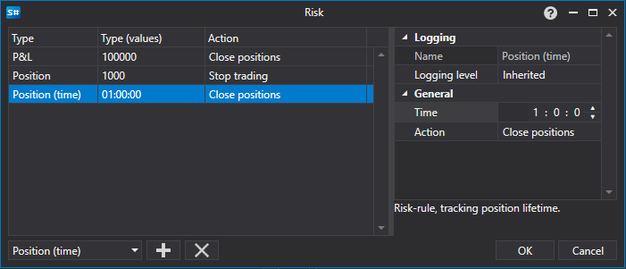

# Risk settings window

[AlertSettingsWindow](../api/StockSharp.Alerts.AlertSettingsWindow.html) \- A special window for configuring risk control. 



The following is an example of the code to call the risk control settings window for the strategy. 

```cs
		private void RiskButton_OnClick(object sender, RoutedEventArgs e)
		{
			var wnd = new RiskWindow();
			wnd.Rules.AddRange(Strategy.RiskManager.Rules.Select(r => r.Clone()));
			if (!wnd.ShowModal(this))
				return;
			Strategy.RiskManager.Rules.Clear();
			Strategy.RiskManager.Rules.AddRange(wnd.Rules);
		}
	  				
```
