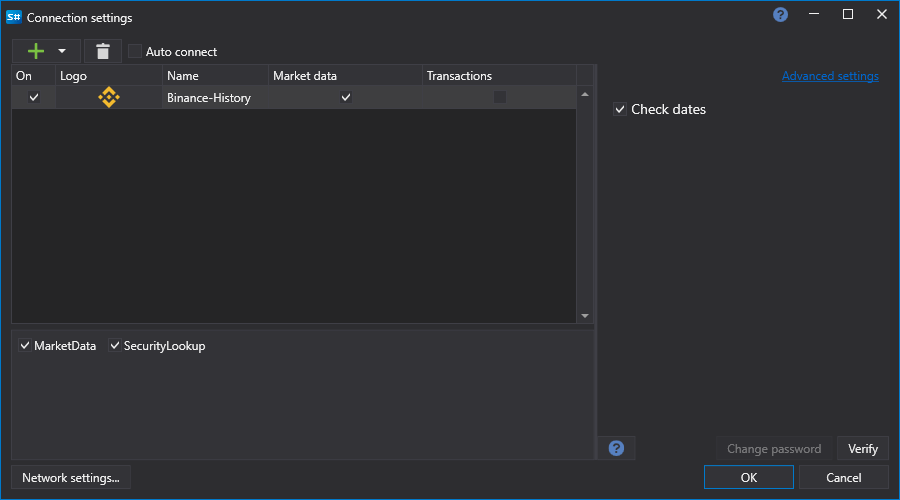

# Graphical configuration Binance History

For all [S\#](StockSharpAbout.md) products, graphical configuration of the connection is performed on the [Connection settings window](API_UI_ConnectorWindow.md):

- **Check dates** \- Validate requested dates before send downloading requests.