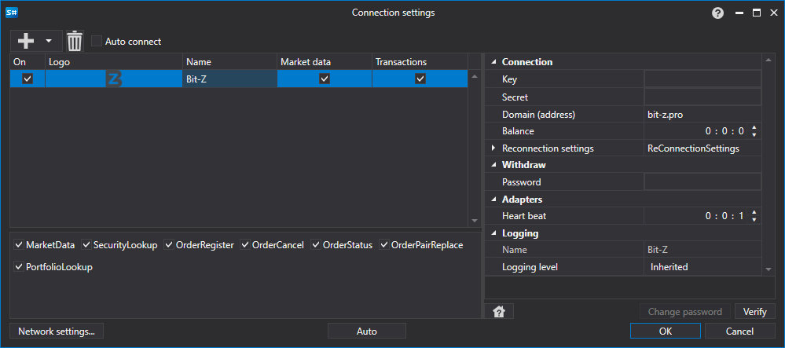

# Graphical configuration BitZ

For all [S\#](StockSharpAbout.md) products, graphical configuration of the connection is performed on the [Connection settings window](API_UI_ConnectorWindow.md):

- **Key**

   \- Key.
- **Secret**

   \- Secret.
- **Domain (address)**

   \- Domain address.
- **Balance**

   \- Balance check interval. Required in case of deposit and withdraw actions.
- **Password**

   \- Administrative password.
- **Heart beat**

   \- Server check interval for track the connection alive. By default equal to 1 minute.
- **Reconnection settings**

   \- Mechanism for tracking connections with the trading system settings. (

  [Reconnection settings](Reconnect.md)

  )

## Recommended content

[Connectors](API_Connectors.md)

[Graphical configuration](API_ConnectorsUIConfiguration.md)

[Creating own connector](ConnectorCreating.md)

[Save and load settings](API_Connectors_SaveConnectorSettings.md)
