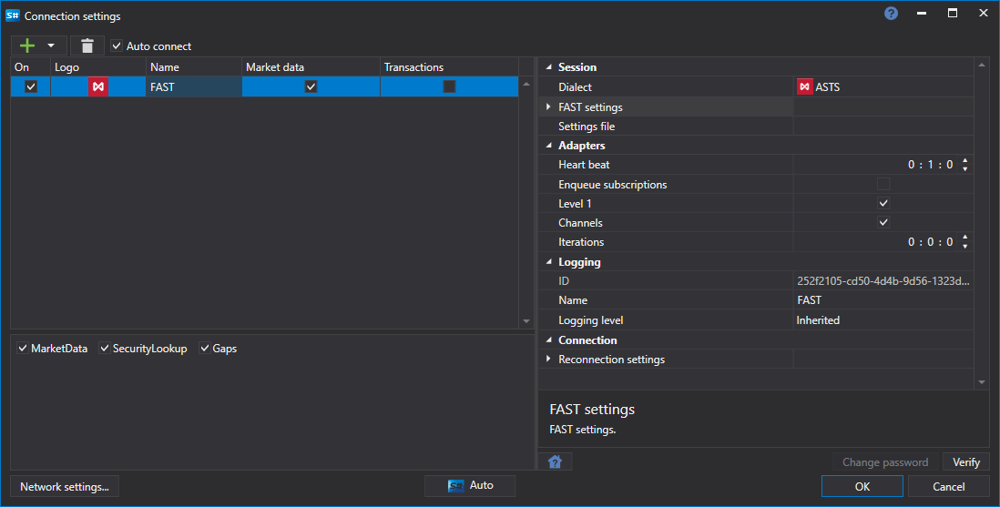

# Graphical configuration FAST

For all [S\#](StockSharpAbout.md) products, graphical configuration of the connection is performed on the [Connection settings window](API_UI_ConnectorWindow.md):

- **Dialect** \- Dialect FAST protocol. Must be set as a first parameter. After select, the next param (**FAST settings**) will contains specified dialect IP addresses.
- **FAST settings** \- Dialect's (selected in prev param) IP addresses and ports. Can use the next option for quick settings load.
- **Settings file** \- Quick option to load dialect settings from an exchange config file.
- **Login** \- Login (use for TCP recovery services).
- **Password** \- Password (use for TCP recovery services).

## Recommended content

[Connectors](API_Connectors.md)

[Graphical configuration](API_ConnectorsUIConfiguration.md)

[Creating own connector](ConnectorCreating.md)

[Save and load settings](API_Connectors_SaveConnectorSettings.md)
