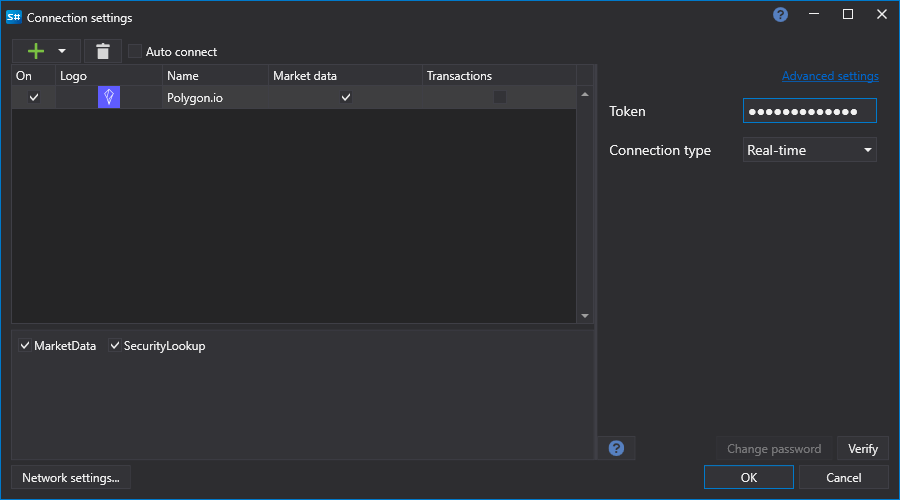

# Graphical configuration PolygonIO

For all [S\#](StockSharpAbout.md) products, graphical configuration of the connection is performed on the [Connection settings window](API_UI_ConnectorWindow.md):

- **Token** \- Token.
- **Connection type** \- Connect to History (REST) or Real-Time (WebSockets).

## Recommended content

[Connectors](API_Connectors.md)

[Graphical configuration](API_ConnectorsUIConfiguration.md)

[Creating own connector](ConnectorCreating.md)

[Save and load settings](API_Connectors_SaveConnectorSettings.md)
