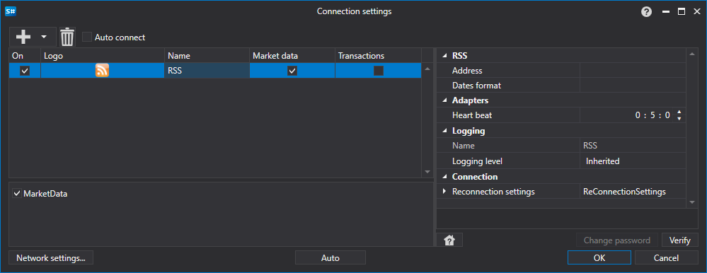

# Graphical configuration RSS

For all [S\#](StockSharpAbout.md) products, graphical configuration of the connection is performed on the [Connection settings window](API_UI_ConnectorWindow.md):

- **Address**

   \- RSS feed address.
- **Dates format**

   \- Dates format Required to be filled if RSS stream format is different from ddd, dd MMM yyyy HH:mm:ss zzzz.
- **Heart beat**

   \- Server check interval for track the connection alive. By default equal to 1 minute.
- **Reconnection settings**

   \- Mechanism for tracking connections with the trading system settings. (

  [Reconnection settings](Reconnect.md)

  )

## Recommended content

[Connectors](API_Connectors.md)

[Graphical configuration](API_ConnectorsUIConfiguration.md)

[Creating own connector](ConnectorCreating.md)

[Save and load settings](API_Connectors_SaveConnectorSettings.md)
