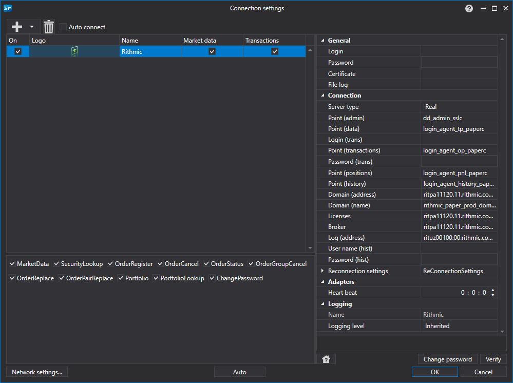

# Graphical configuration Rithmic

For all [S\#](StockSharpAbout.md) products, graphical configuration of the connection is performed on the [Connection settings window](API_UI_ConnectorWindow.md):

- **Login**

   \- Login.
- **Password**

   \- Password.
- **Certificate**

   \- Path to certificate file, necessary to connect to Rithmic system.
- **File log**

   \- Path to log file.
- **Server type**

   \- Server type.
- **Point (admin)**

   \- Connection point for administrative functions (initialization\/deinitialization).
- **Point (data)**

   \- Connection point to market data.
- **Login (trans)**

   \- Additional login. Used when transaction sending is carried out to a separate server.
- **Point (transactions)**

   \- Connection point to the transactions execution system.
- **Password (trans)**

   \- Additional password. Used when transaction sending is carried out to a separate server.
- **Point (positions)**

   \- Connection point for access to portfolios and positions information.
- **Point (history)**

   \- Connection point for access to history data.
- **Domain (address)**

   \- Domain address.
- **Domain (name)**

   \- Domain name.
- **Licenses**

   \- Licenses server address.
- **Broker**

   \- Broker address.
- **Log (address)**

   \- Logger address.
- **User name (hist)**

   \- Additional login. User id used for authentication with the history plant.
- **Password (hist)**

   \- Additional password. Password used for authentication with the history plant
- **Heart beat**

   \- Server check interval for track the connection alive. By default equal to 1 minute.
- **Reconnection settings**

   \- Mechanism for tracking connections with the trading system settings. (

  [Reconnection settings](Reconnect.md)

  )

## Recommended content

[Connectors](API_Connectors.md)

[Graphical configuration](API_ConnectorsUIConfiguration.md)

[Creating own connector](ConnectorCreating.md)

[Save and load settings](API_Connectors_SaveConnectorSettings.md)
