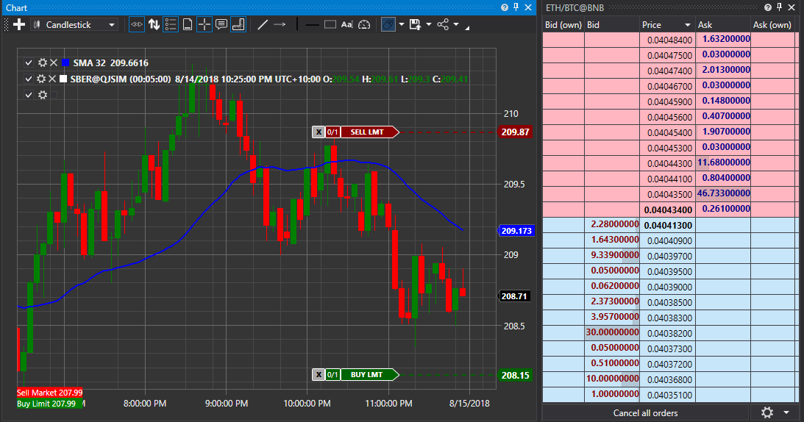

# Themes of S\# graphic components

For all S\# graphic elements, there are several different themes. Below are the two most popular themes.




To install the application theme, just write one line. For example, to set the VisualStudio 2017 dark theme, you have to specify the line:

```cs
...                 
ApplicationThemeHelper.ApplicationThemeName \= Theme.VS2017DarkName;
...
```

Since all S\# graphics elements are based on **DevExpress** graphic elements, you need to add the appropriate **DevExpress** libraries (**DevExpress.Xpf.Core**, **DevExpress.Xpf.Themes.VS2017Dark**, etc.)
