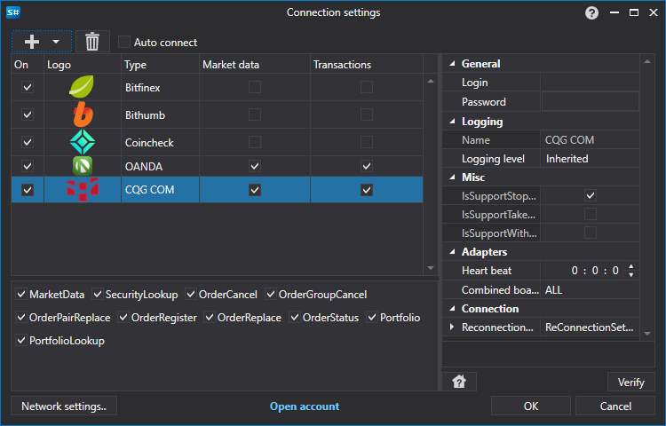

# Connection settings window

[ConnectorWindow](../api/StockSharp.Xaml.ConnectorWindow.html) \- a special window for configuring adapters for connecting a connector. 



Here is the connection settings window. From the drop\-down list (opens with the '+' button), you need to select the necessary adapters and configure their properties in the properties window located on the right. 

This window should be called through the [Configure](../api/StockSharp.Xaml.Extensions.Configure.html), extension method, into which the [Connector](../api/StockSharp.Algo.Connector.html) and the parent window are passed. If the configuration is successful, the [Configure](../api/StockSharp.Xaml.Extensions.Configure.html) extension method will return 'true'. Below is the code to call the connector connection settings window and save the settings to a file. 

```cs
		private void Setting\_Click(object sender, RoutedEventArgs e)
		{
			if (\_connector.Configure(this))
			{
				new XmlSerializer\<SettingsStorage\>().Serialize(\_connector.Save(), \_connectorFile);
			}
		}
	  				
```

> [!TIP]
> The connection correctness can be checked using the **Check** button.

The result of this window will be to create and add adapters to the list of *internal adapters* of the [Connector.Adapter](../api/StockSharp.Algo.Connector.Adapter.html) property. 

For more information about saving and loading connector settings, see [Save and load settings](API_Connectors_SaveConnectorSettings.md).
