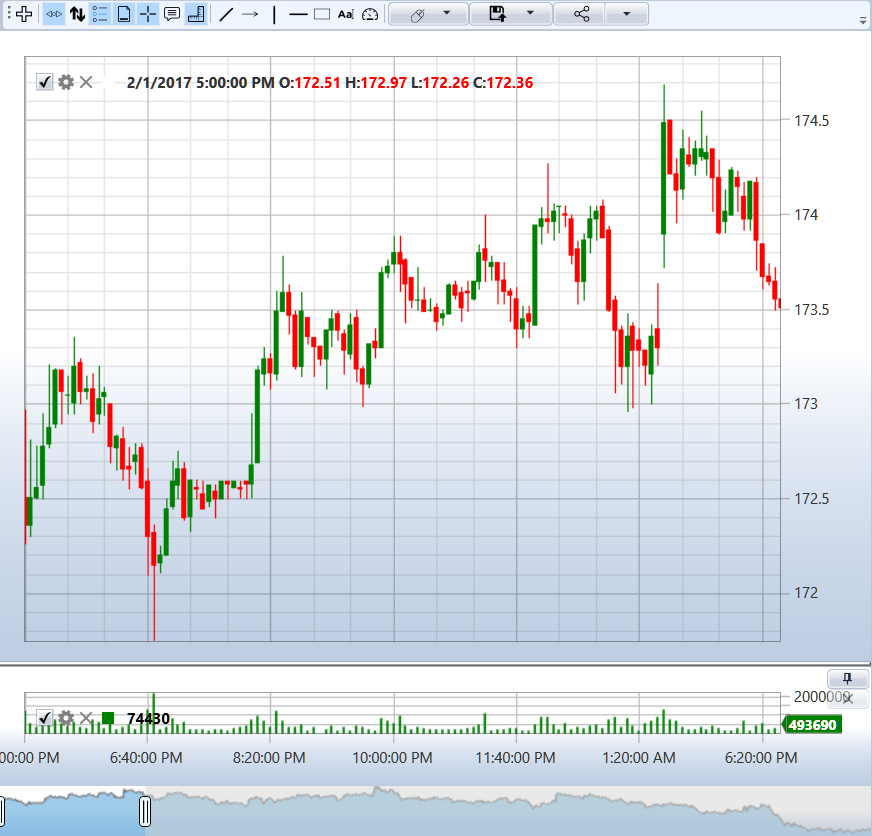
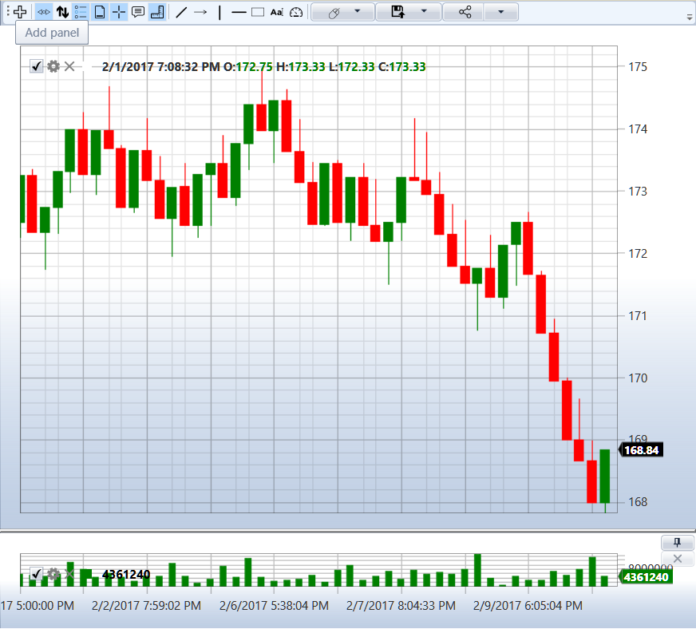

# Candles

[S\#](StockSharpAbout.md) supports the following types:

- [TimeFrameCandle](xref:StockSharp.Algo.Candles.TimeFrameCandle) \- candle based on timeframe. You can set both popular intervals (minute, hour, day), and customized. For example, 21 seconds, 4.5 minutes, etc. 
- [RangeCandle](xref:StockSharp.Algo.Candles.RangeCandle) \- price range candle. A new candle is created when a trade appears with a price that is out of range. An allowable range is formed each time based on the price of the first trade. 
- [VolumeCandle](xref:StockSharp.Algo.Candles.VolumeCandle) \- a candle is created until the total volume of trades is exceeded. If the new trade exceeds the permissible volume, then it falls into the new candle already. 
- [TickCandle](xref:StockSharp.Algo.Candles.TickCandle) \- is the same as [VolumeCandle](xref:StockSharp.Algo.Candles.VolumeCandle), only the number of trades is taken as a restriction instead of volume. 
- [PnFCandle](xref:StockSharp.Algo.Candles.PnFCandle) \- a candle of the point\-and\-figure chart (tic\-tac\-toe chart). 
- [RenkoCandle](xref:StockSharp.Algo.Candles.RenkoCandle) \- Renko candle. 

How to work with candles is shown in the SampleConnection example, which is located in the *Samples\/Common\/SampleConnection*.

The following figures show [TimeFrameCandle](xref:StockSharp.Algo.Candles.TimeFrameCandle) and [RangeCandle](xref:StockSharp.Algo.Candles.RangeCandle) charts:





## Start getting data

1. 1. Create a series of [CandleSeries](xref:StockSharp.Algo.Candles.CandleSeries) candles: 

   ```cs
   ...
   _candleSeries = new CandleSeries(CandleSettingsEditor.Settings.CandleType, security, CandleSettingsEditor.Settings.Arg);
   ...		
   					
   ```
2. All the necessary methods for getting candles are implemented in the [Connector](xref:StockSharp.Algo.Connector) class.

   To get candles, you need to subscribe to the [Connector.CandleSeriesProcessing](xref:StockSharp.Algo.Connector.CandleSeriesProcessing), event, which signals the appearance of a new value for processing:

   ```cs
   _connector.CandleSeriesProcessing += Connector_CandleSeriesProcessing;
   ...
   private void Connector_CandleSeriesProcessing(CandleSeries candleSeries, Candle candle)
   {
   	Chart.Draw(_candleElement, candle);
   }
   ...
   					
   ```

   > [!TIP]
   > To display the candles, the [Chart](xref:StockSharp.Xaml.Charting.Chart) graphic component is used. 
3. Next, pass the created candle series to the connector and start getting data through [Connector.Subscribe](xref:StockSharp.Algo.Connector.Subscribe(StockSharp.Algo.Subscription))**(**[StockSharp.Algo.Subscription](xref:StockSharp.Algo.Subscription) subscription**)**:

   ```cs
   ...
   _connector.Subscribe(_candleSeries);
   ...
   		
   					
   ```

   After this stage, the [Connector.CandleSeriesProcessing](xref:StockSharp.Algo.Connector.CandleSeriesProcessing) event will be raised.
4. The [Connector.CandleSeriesProcessing](xref:StockSharp.Algo.Connector.CandleSeriesProcessing) event is raised not only when a new candle appears, but also when the current one changes.

   If you want to display only **"whole"** candles, then you need to check the [Candle.State](xref:StockSharp.Algo.Candles.Candle.State) property of the arrived candle:

   ```cs
   ...
   private void Connector_CandleSeriesProcessing(CandleSeries candleSeries, Candle candle)
   {
       if (candle.State == CandleStates.Finished) 
       {
          var chartData = new ChartDrawData();
          chartData.Group(candle.OpenTime).Add(_candleElement, candle);
          Chart.Draw(chartData);
       }
   }
   ...
   		
   ```
5. You can set some properties for [CandleSeries](xref:StockSharp.Algo.Candles.CandleSeries):
   - [CandleSeries.BuildCandlesMode](xref:StockSharp.Algo.Candles.CandleSeries.BuildCandlesMode) sets the mode of building candles. By default, [MarketDataBuildModes.LoadAndBuild](xref:StockSharp.Messages.MarketDataBuildModes.LoadAndBuild) is specified, which means that finished data will be requested, or built from the data type specified in the [CandleSeries.BuildCandlesFrom](xref:StockSharp.Algo.Candles.CandleSeries.BuildCandlesFrom) property. You can also set [MarketDataBuildModes.Load](xref:StockSharp.Messages.MarketDataBuildModes.Load) to request only finished data. Or [MarketDataBuildModes.Build](xref:StockSharp.Messages.MarketDataBuildModes.Build), for building from the data type specified in the [CandleSeries.BuildCandlesFrom](xref:StockSharp.Algo.Candles.CandleSeries.BuildCandlesFrom) property without requesting the finished data. 
   - When building candles, you need to set the [CandleSeries.BuildCandlesFrom](xref:StockSharp.Algo.Candles.CandleSeries.BuildCandlesFrom), property, which indicates which data type is used as a source ([MarketDataTypes.Level1](xref:StockSharp.Messages.MarketDataTypes.Level1), [MarketDataTypes.MarketDepth](xref:StockSharp.Messages.MarketDataTypes.MarketDepth), [MarketDataTypes.Trades](xref:StockSharp.Messages.MarketDataTypes.Trades) and etc. ). 
   - For some data types, you need to additionally specify the [CandleSeries.BuildCandlesField](xref:StockSharp.Algo.Candles.CandleSeries.BuildCandlesField), property from which the data will be built. For example, for [MarketDataTypes.Level1](xref:StockSharp.Messages.MarketDataTypes.Level1) , you can specify [Level1Fields.BestAskPrice](xref:StockSharp.Messages.Level1Fields.BestAskPrice), , which means that candles will be built from the [Level1Fields.BestAskPrice](xref:StockSharp.Messages.Level1Fields.BestAskPrice) property of [MarketDataTypes.Level1](xref:StockSharp.Messages.MarketDataTypes.Level1) data. 
6. Let's consider a few examples of building different candle types:
   - Since most sources provide candles with standard timeframes, it’s enough to set the type and timeframe to get such candles: 

     ```cs
     _candleSeries = new CandleSeries(typeof(TimeFrameCandle), security, TimeSpan.FromMinutes(5));
     					
     ```
   - If you just want to load the finished candles, then you need to set the [CandleSeries.BuildCandlesMode](xref:StockSharp.Algo.Candles.CandleSeries.BuildCandlesMode) property in [MarketDataBuildModes.Load](xref:StockSharp.Messages.MarketDataBuildModes.Load): 

     ```cs
     _candleSeries = new CandleSeries(typeof(TimeFrameCandle), security, TimeSpan.FromMinutes(5))
     {
     	BuildCandlesMode = MarketDataBuildModes.Load,
     };	
     					
     ```
   - If the source does not provide the necessary timeframe candles, then they can be built from other market data. Below is an example of building candles with a timeframe of 21 seconds from trades: 

     ```cs
     _candleSeries = new CandleSeries(typeof(TimeFrameCandle), security, TimeSpan.FromSeconds(21))
     {
     	BuildCandlesMode = MarketDataBuildModes.Build,
     	BuildCandlesFrom = MarketDataTypes.Trades,
     };	
     					
     ```
   - If the data source provides neither candles nor trades, candles can be built from the market depth spread: 

     ```cs
     _candleSeries = new CandleSeries(typeof(TimeFrameCandle), security, TimeSpan.FromSeconds(21))
     {
     	BuildCandlesMode = MarketDataBuildModes.Build,
     	BuildCandlesFrom = MarketDataTypes.MarketDepth,
     	BuildCandlesField = Level1Fields.SpreadMiddle,
     };	
     					
     ```
   - Since there are no sources providing a ready **volume profile**, it also needs to be built from another data type. To draw a **volume profile**, you need to set the [CandleSeries.IsCalcVolumeProfile](xref:StockSharp.Algo.Candles.CandleSeries.IsCalcVolumeProfile) property to 'true', as well as [CandleSeries.BuildCandlesMode](xref:StockSharp.Algo.Candles.CandleSeries.BuildCandlesMode) to [MarketDataBuildModes.Build](xref:StockSharp.Messages.MarketDataBuildModes.Build). And specify the data type from which the **volume profile** will be built. In this case, it's [MarketDataTypes.Trades](xref:StockSharp.Messages.MarketDataTypes.Trades): 

     ```cs
     _candleSeries = new CandleSeries(typeof(TimeFrameCandle), security, TimeSpan.FromMinutes(5))
     {
     	BuildCandlesMode = MarketDataBuildModes.Build,
     	BuildCandlesFrom = MarketDataTypes.Trades,
         IsCalcVolumeProfile = true,
     };	
     					
     ```
   - o Since most data sources do not provide finished candles, except for [TimeFrameCandle](xref:StockSharp.Algo.Candles.TimeFrameCandle), , other candle types are built similarly to the **volume profile**. You need to set the [CandleSeries.BuildCandlesMode](xref:StockSharp.Algo.Candles.CandleSeries.BuildCandlesMode) property to [MarketDataBuildModes.Build](xref:StockSharp.Messages.MarketDataBuildModes.Build) or [MarketDataBuildModes.LoadAndBuild](xref:StockSharp.Messages.MarketDataBuildModes.LoadAndBuild). Also set the [CandleSeries.BuildCandlesFrom](xref:StockSharp.Algo.Candles.CandleSeries.BuildCandlesFrom) property and the [CandleSeries.BuildCandlesField](xref:StockSharp.Algo.Candles.CandleSeries.BuildCandlesField) property, if necessary. 

     The following code shows building a [VolumeCandle](xref:StockSharp.Algo.Candles.VolumeCandle) with a volume of 1000 contracts. The middle of the market depth spread is used as the data source for building.

     ```cs
     _candleSeries = new CandleSeries(typeof(VolumeCandle), security, 1000m)
     {
     	BuildCandlesMode = MarketDataBuildModes.LoadAndBuild,
     	BuildCandlesFrom = MarketDataTypes.MarketDepth,
     	BuildCandlesField = Level1Fields.SpreadMiddle,
     };
     					
     ```
   - The following code shows building a [TickCandle](xref:StockSharp.Algo.Candles.TickCandle) of 1000 trades. Trades are used as a data source for building.

     ```cs
     	   
     _candleSeries = new CandleSeries(typeof(TickCandle), security, 1000)
     {
     	BuildCandlesMode = MarketDataBuildModes.Build,
     	BuildCandlesFrom = MarketDataTypes.Trades,
     };
     					
     ```
   - The following code shows building a [RangeCandle](xref:StockSharp.Algo.Candles.RangeCandle) with a range of 0.1 c.u. The best buy of a market depth is used as a data source for building:

     ```cs
     _candleSeries = new CandleSeries(typeof(RangeCandle), security, new Unit(0.1m))
     {
     	BuildCandlesMode = MarketDataBuildModes.LoadAndBuild,
         BuildCandlesFrom = MarketDataTypes.MarketDepth,
         BuildCandlesField = Level1Fields.BestBid,
     };
     					
     ```
   - The following code shows the building [RenkoCandle](xref:StockSharp.Algo.Candles.RenkoCandle). The price of the last trade from Level1 is used as a data source for building:

     ```cs
     _candleSeries = new CandleSeries(typeof(RenkoCandle), security, new Unit(0.1m))
     {
     	BuildCandlesMode = MarketDataBuildModes.LoadAndBuild,
         BuildCandlesFrom = MarketDataTypes.Level1,
         BuildCandlesField = Level1Fields.LastTradePrice,
     };
     					
     ```
   - The following code shows the building [PnFCandle](xref:StockSharp.Algo.Candles.PnFCandle). Trades are used as a data source for building.

     ```cs
     _candleSeries = new CandleSeries(typeof(PnFCandle), security, new PnFArg() { BoxSize = 0.1m, ReversalAmount =1})
     {
     	BuildCandlesMode = MarketDataBuildModes.Build,
     	BuildCandlesFrom = MarketDataTypes.Trades,
     };	
     					
     ```

## Recommended content

[Chart](CandlesUI.md)

[Patterns](CandlesPatterns.md)

[Custom type of candle](CandlesCandleFactory.md)
